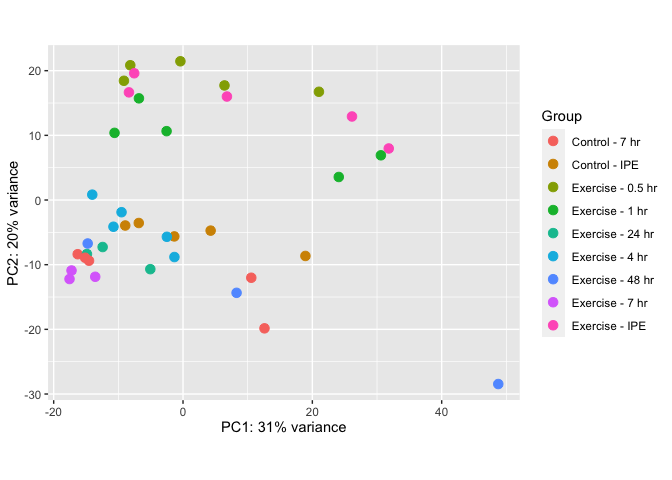

Examination of Rat RNA-Seq Data: Examine Batch Effects
================
Alec Steep and Jiayu Zhang
20200320

# Goals of Analysis

  - TODO: Add Step-by-step goals of
analysis

## Setup the Environment

``` r
################################################################################
##### Resources and Dependencies ###############################################
################################################################################

# Set the working directory
WD <- '/Volumes/Frishman_4TB/motrpac/20200309_rna-seq_steep'
#setwd(WD)

# Load the dependencies
#source("https://bioconductor.org/biocLite.R")
#BiocManager::install("org.Rn.eg.db")
#install.packages("tidyverse")

# Load dependencies
pacs...man <- c("tidyverse","GenomicRanges", "DESeq2","devtools","rafalib","GO.db","vsn","hexbin","ggplot2",
                "GenomicFeatures","Biostrings","BSgenome","AnnotationHub","plyr","dplyr",
                "org.Rn.eg.db","pheatmap","sva","formula.tools","pathview","biomaRt","feather",
                "PROPER","SeqGSEA",'purrr','BioInstaller','RColorBrewer','lubridate', "hms")
lapply(pacs...man, FUN = function(X) {
        do.call("library", list(X)) 
})
```

    ## [[1]]
    ##  [1] "forcats"   "stringr"   "dplyr"     "purrr"     "readr"     "tidyr"    
    ##  [7] "tibble"    "ggplot2"   "tidyverse" "stats"     "graphics"  "grDevices"
    ## [13] "utils"     "datasets"  "methods"   "base"     
    ## 
    ## [[2]]
    ##  [1] "GenomicRanges" "GenomeInfoDb"  "IRanges"       "S4Vectors"    
    ##  [5] "BiocGenerics"  "parallel"      "stats4"        "forcats"      
    ##  [9] "stringr"       "dplyr"         "purrr"         "readr"        
    ## [13] "tidyr"         "tibble"        "ggplot2"       "tidyverse"    
    ## [17] "stats"         "graphics"      "grDevices"     "utils"        
    ## [21] "datasets"      "methods"       "base"         
    ## 
    ## [[3]]
    ##  [1] "DESeq2"               "SummarizedExperiment" "DelayedArray"        
    ##  [4] "BiocParallel"         "matrixStats"          "Biobase"             
    ##  [7] "GenomicRanges"        "GenomeInfoDb"         "IRanges"             
    ## [10] "S4Vectors"            "BiocGenerics"         "parallel"            
    ## [13] "stats4"               "forcats"              "stringr"             
    ## [16] "dplyr"                "purrr"                "readr"               
    ## [19] "tidyr"                "tibble"               "ggplot2"             
    ## [22] "tidyverse"            "stats"                "graphics"            
    ## [25] "grDevices"            "utils"                "datasets"            
    ## [28] "methods"              "base"                
    ## 
    ## [[4]]
    ##  [1] "devtools"             "usethis"              "DESeq2"              
    ##  [4] "SummarizedExperiment" "DelayedArray"         "BiocParallel"        
    ##  [7] "matrixStats"          "Biobase"              "GenomicRanges"       
    ## [10] "GenomeInfoDb"         "IRanges"              "S4Vectors"           
    ## [13] "BiocGenerics"         "parallel"             "stats4"              
    ## [16] "forcats"              "stringr"              "dplyr"               
    ## [19] "purrr"                "readr"                "tidyr"               
    ## [22] "tibble"               "ggplot2"              "tidyverse"           
    ## [25] "stats"                "graphics"             "grDevices"           
    ## [28] "utils"                "datasets"             "methods"             
    ## [31] "base"                
    ## 
    ## [[5]]
    ##  [1] "rafalib"              "devtools"             "usethis"             
    ##  [4] "DESeq2"               "SummarizedExperiment" "DelayedArray"        
    ##  [7] "BiocParallel"         "matrixStats"          "Biobase"             
    ## [10] "GenomicRanges"        "GenomeInfoDb"         "IRanges"             
    ## [13] "S4Vectors"            "BiocGenerics"         "parallel"            
    ## [16] "stats4"               "forcats"              "stringr"             
    ## [19] "dplyr"                "purrr"                "readr"               
    ## [22] "tidyr"                "tibble"               "ggplot2"             
    ## [25] "tidyverse"            "stats"                "graphics"            
    ## [28] "grDevices"            "utils"                "datasets"            
    ## [31] "methods"              "base"                
    ## 
    ## [[6]]
    ##  [1] "GO.db"                "AnnotationDbi"        "rafalib"             
    ##  [4] "devtools"             "usethis"              "DESeq2"              
    ##  [7] "SummarizedExperiment" "DelayedArray"         "BiocParallel"        
    ## [10] "matrixStats"          "Biobase"              "GenomicRanges"       
    ## [13] "GenomeInfoDb"         "IRanges"              "S4Vectors"           
    ## [16] "BiocGenerics"         "parallel"             "stats4"              
    ## [19] "forcats"              "stringr"              "dplyr"               
    ## [22] "purrr"                "readr"                "tidyr"               
    ## [25] "tibble"               "ggplot2"              "tidyverse"           
    ## [28] "stats"                "graphics"             "grDevices"           
    ## [31] "utils"                "datasets"             "methods"             
    ## [34] "base"                
    ## 
    ## [[7]]
    ##  [1] "vsn"                  "GO.db"                "AnnotationDbi"       
    ##  [4] "rafalib"              "devtools"             "usethis"             
    ##  [7] "DESeq2"               "SummarizedExperiment" "DelayedArray"        
    ## [10] "BiocParallel"         "matrixStats"          "Biobase"             
    ## [13] "GenomicRanges"        "GenomeInfoDb"         "IRanges"             
    ## [16] "S4Vectors"            "BiocGenerics"         "parallel"            
    ## [19] "stats4"               "forcats"              "stringr"             
    ## [22] "dplyr"                "purrr"                "readr"               
    ## [25] "tidyr"                "tibble"               "ggplot2"             
    ## [28] "tidyverse"            "stats"                "graphics"            
    ## [31] "grDevices"            "utils"                "datasets"            
    ## [34] "methods"              "base"                
    ## 
    ## [[8]]
    ##  [1] "hexbin"               "vsn"                  "GO.db"               
    ##  [4] "AnnotationDbi"        "rafalib"              "devtools"            
    ##  [7] "usethis"              "DESeq2"               "SummarizedExperiment"
    ## [10] "DelayedArray"         "BiocParallel"         "matrixStats"         
    ## [13] "Biobase"              "GenomicRanges"        "GenomeInfoDb"        
    ## [16] "IRanges"              "S4Vectors"            "BiocGenerics"        
    ## [19] "parallel"             "stats4"               "forcats"             
    ## [22] "stringr"              "dplyr"                "purrr"               
    ## [25] "readr"                "tidyr"                "tibble"              
    ## [28] "ggplot2"              "tidyverse"            "stats"               
    ## [31] "graphics"             "grDevices"            "utils"               
    ## [34] "datasets"             "methods"              "base"                
    ## 
    ## [[9]]
    ##  [1] "hexbin"               "vsn"                  "GO.db"               
    ##  [4] "AnnotationDbi"        "rafalib"              "devtools"            
    ##  [7] "usethis"              "DESeq2"               "SummarizedExperiment"
    ## [10] "DelayedArray"         "BiocParallel"         "matrixStats"         
    ## [13] "Biobase"              "GenomicRanges"        "GenomeInfoDb"        
    ## [16] "IRanges"              "S4Vectors"            "BiocGenerics"        
    ## [19] "parallel"             "stats4"               "forcats"             
    ## [22] "stringr"              "dplyr"                "purrr"               
    ## [25] "readr"                "tidyr"                "tibble"              
    ## [28] "ggplot2"              "tidyverse"            "stats"               
    ## [31] "graphics"             "grDevices"            "utils"               
    ## [34] "datasets"             "methods"              "base"                
    ## 
    ## [[10]]
    ##  [1] "GenomicFeatures"      "hexbin"               "vsn"                 
    ##  [4] "GO.db"                "AnnotationDbi"        "rafalib"             
    ##  [7] "devtools"             "usethis"              "DESeq2"              
    ## [10] "SummarizedExperiment" "DelayedArray"         "BiocParallel"        
    ## [13] "matrixStats"          "Biobase"              "GenomicRanges"       
    ## [16] "GenomeInfoDb"         "IRanges"              "S4Vectors"           
    ## [19] "BiocGenerics"         "parallel"             "stats4"              
    ## [22] "forcats"              "stringr"              "dplyr"               
    ## [25] "purrr"                "readr"                "tidyr"               
    ## [28] "tibble"               "ggplot2"              "tidyverse"           
    ## [31] "stats"                "graphics"             "grDevices"           
    ## [34] "utils"                "datasets"             "methods"             
    ## [37] "base"                
    ## 
    ## [[11]]
    ##  [1] "Biostrings"           "XVector"              "GenomicFeatures"     
    ##  [4] "hexbin"               "vsn"                  "GO.db"               
    ##  [7] "AnnotationDbi"        "rafalib"              "devtools"            
    ## [10] "usethis"              "DESeq2"               "SummarizedExperiment"
    ## [13] "DelayedArray"         "BiocParallel"         "matrixStats"         
    ## [16] "Biobase"              "GenomicRanges"        "GenomeInfoDb"        
    ## [19] "IRanges"              "S4Vectors"            "BiocGenerics"        
    ## [22] "parallel"             "stats4"               "forcats"             
    ## [25] "stringr"              "dplyr"                "purrr"               
    ## [28] "readr"                "tidyr"                "tibble"              
    ## [31] "ggplot2"              "tidyverse"            "stats"               
    ## [34] "graphics"             "grDevices"            "utils"               
    ## [37] "datasets"             "methods"              "base"                
    ## 
    ## [[12]]
    ##  [1] "BSgenome"             "rtracklayer"          "Biostrings"          
    ##  [4] "XVector"              "GenomicFeatures"      "hexbin"              
    ##  [7] "vsn"                  "GO.db"                "AnnotationDbi"       
    ## [10] "rafalib"              "devtools"             "usethis"             
    ## [13] "DESeq2"               "SummarizedExperiment" "DelayedArray"        
    ## [16] "BiocParallel"         "matrixStats"          "Biobase"             
    ## [19] "GenomicRanges"        "GenomeInfoDb"         "IRanges"             
    ## [22] "S4Vectors"            "BiocGenerics"         "parallel"            
    ## [25] "stats4"               "forcats"              "stringr"             
    ## [28] "dplyr"                "purrr"                "readr"               
    ## [31] "tidyr"                "tibble"               "ggplot2"             
    ## [34] "tidyverse"            "stats"                "graphics"            
    ## [37] "grDevices"            "utils"                "datasets"            
    ## [40] "methods"              "base"                
    ## 
    ## [[13]]
    ##  [1] "AnnotationHub"        "BiocFileCache"        "dbplyr"              
    ##  [4] "BSgenome"             "rtracklayer"          "Biostrings"          
    ##  [7] "XVector"              "GenomicFeatures"      "hexbin"              
    ## [10] "vsn"                  "GO.db"                "AnnotationDbi"       
    ## [13] "rafalib"              "devtools"             "usethis"             
    ## [16] "DESeq2"               "SummarizedExperiment" "DelayedArray"        
    ## [19] "BiocParallel"         "matrixStats"          "Biobase"             
    ## [22] "GenomicRanges"        "GenomeInfoDb"         "IRanges"             
    ## [25] "S4Vectors"            "BiocGenerics"         "parallel"            
    ## [28] "stats4"               "forcats"              "stringr"             
    ## [31] "dplyr"                "purrr"                "readr"               
    ## [34] "tidyr"                "tibble"               "ggplot2"             
    ## [37] "tidyverse"            "stats"                "graphics"            
    ## [40] "grDevices"            "utils"                "datasets"            
    ## [43] "methods"              "base"                
    ## 
    ## [[14]]
    ##  [1] "plyr"                 "AnnotationHub"        "BiocFileCache"       
    ##  [4] "dbplyr"               "BSgenome"             "rtracklayer"         
    ##  [7] "Biostrings"           "XVector"              "GenomicFeatures"     
    ## [10] "hexbin"               "vsn"                  "GO.db"               
    ## [13] "AnnotationDbi"        "rafalib"              "devtools"            
    ## [16] "usethis"              "DESeq2"               "SummarizedExperiment"
    ## [19] "DelayedArray"         "BiocParallel"         "matrixStats"         
    ## [22] "Biobase"              "GenomicRanges"        "GenomeInfoDb"        
    ## [25] "IRanges"              "S4Vectors"            "BiocGenerics"        
    ## [28] "parallel"             "stats4"               "forcats"             
    ## [31] "stringr"              "dplyr"                "purrr"               
    ## [34] "readr"                "tidyr"                "tibble"              
    ## [37] "ggplot2"              "tidyverse"            "stats"               
    ## [40] "graphics"             "grDevices"            "utils"               
    ## [43] "datasets"             "methods"              "base"                
    ## 
    ## [[15]]
    ##  [1] "plyr"                 "AnnotationHub"        "BiocFileCache"       
    ##  [4] "dbplyr"               "BSgenome"             "rtracklayer"         
    ##  [7] "Biostrings"           "XVector"              "GenomicFeatures"     
    ## [10] "hexbin"               "vsn"                  "GO.db"               
    ## [13] "AnnotationDbi"        "rafalib"              "devtools"            
    ## [16] "usethis"              "DESeq2"               "SummarizedExperiment"
    ## [19] "DelayedArray"         "BiocParallel"         "matrixStats"         
    ## [22] "Biobase"              "GenomicRanges"        "GenomeInfoDb"        
    ## [25] "IRanges"              "S4Vectors"            "BiocGenerics"        
    ## [28] "parallel"             "stats4"               "forcats"             
    ## [31] "stringr"              "dplyr"                "purrr"               
    ## [34] "readr"                "tidyr"                "tibble"              
    ## [37] "ggplot2"              "tidyverse"            "stats"               
    ## [40] "graphics"             "grDevices"            "utils"               
    ## [43] "datasets"             "methods"              "base"                
    ## 
    ## [[16]]
    ##  [1] "org.Rn.eg.db"         "plyr"                 "AnnotationHub"       
    ##  [4] "BiocFileCache"        "dbplyr"               "BSgenome"            
    ##  [7] "rtracklayer"          "Biostrings"           "XVector"             
    ## [10] "GenomicFeatures"      "hexbin"               "vsn"                 
    ## [13] "GO.db"                "AnnotationDbi"        "rafalib"             
    ## [16] "devtools"             "usethis"              "DESeq2"              
    ## [19] "SummarizedExperiment" "DelayedArray"         "BiocParallel"        
    ## [22] "matrixStats"          "Biobase"              "GenomicRanges"       
    ## [25] "GenomeInfoDb"         "IRanges"              "S4Vectors"           
    ## [28] "BiocGenerics"         "parallel"             "stats4"              
    ## [31] "forcats"              "stringr"              "dplyr"               
    ## [34] "purrr"                "readr"                "tidyr"               
    ## [37] "tibble"               "ggplot2"              "tidyverse"           
    ## [40] "stats"                "graphics"             "grDevices"           
    ## [43] "utils"                "datasets"             "methods"             
    ## [46] "base"                
    ## 
    ## [[17]]
    ##  [1] "pheatmap"             "org.Rn.eg.db"         "plyr"                
    ##  [4] "AnnotationHub"        "BiocFileCache"        "dbplyr"              
    ##  [7] "BSgenome"             "rtracklayer"          "Biostrings"          
    ## [10] "XVector"              "GenomicFeatures"      "hexbin"              
    ## [13] "vsn"                  "GO.db"                "AnnotationDbi"       
    ## [16] "rafalib"              "devtools"             "usethis"             
    ## [19] "DESeq2"               "SummarizedExperiment" "DelayedArray"        
    ## [22] "BiocParallel"         "matrixStats"          "Biobase"             
    ## [25] "GenomicRanges"        "GenomeInfoDb"         "IRanges"             
    ## [28] "S4Vectors"            "BiocGenerics"         "parallel"            
    ## [31] "stats4"               "forcats"              "stringr"             
    ## [34] "dplyr"                "purrr"                "readr"               
    ## [37] "tidyr"                "tibble"               "ggplot2"             
    ## [40] "tidyverse"            "stats"                "graphics"            
    ## [43] "grDevices"            "utils"                "datasets"            
    ## [46] "methods"              "base"                
    ## 
    ## [[18]]
    ##  [1] "sva"                  "genefilter"           "mgcv"                
    ##  [4] "nlme"                 "pheatmap"             "org.Rn.eg.db"        
    ##  [7] "plyr"                 "AnnotationHub"        "BiocFileCache"       
    ## [10] "dbplyr"               "BSgenome"             "rtracklayer"         
    ## [13] "Biostrings"           "XVector"              "GenomicFeatures"     
    ## [16] "hexbin"               "vsn"                  "GO.db"               
    ## [19] "AnnotationDbi"        "rafalib"              "devtools"            
    ## [22] "usethis"              "DESeq2"               "SummarizedExperiment"
    ## [25] "DelayedArray"         "BiocParallel"         "matrixStats"         
    ## [28] "Biobase"              "GenomicRanges"        "GenomeInfoDb"        
    ## [31] "IRanges"              "S4Vectors"            "BiocGenerics"        
    ## [34] "parallel"             "stats4"               "forcats"             
    ## [37] "stringr"              "dplyr"                "purrr"               
    ## [40] "readr"                "tidyr"                "tibble"              
    ## [43] "ggplot2"              "tidyverse"            "stats"               
    ## [46] "graphics"             "grDevices"            "utils"               
    ## [49] "datasets"             "methods"              "base"                
    ## 
    ## [[19]]
    ##  [1] "formula.tools"        "sva"                  "genefilter"          
    ##  [4] "mgcv"                 "nlme"                 "pheatmap"            
    ##  [7] "org.Rn.eg.db"         "plyr"                 "AnnotationHub"       
    ## [10] "BiocFileCache"        "dbplyr"               "BSgenome"            
    ## [13] "rtracklayer"          "Biostrings"           "XVector"             
    ## [16] "GenomicFeatures"      "hexbin"               "vsn"                 
    ## [19] "GO.db"                "AnnotationDbi"        "rafalib"             
    ## [22] "devtools"             "usethis"              "DESeq2"              
    ## [25] "SummarizedExperiment" "DelayedArray"         "BiocParallel"        
    ## [28] "matrixStats"          "Biobase"              "GenomicRanges"       
    ## [31] "GenomeInfoDb"         "IRanges"              "S4Vectors"           
    ## [34] "BiocGenerics"         "parallel"             "stats4"              
    ## [37] "forcats"              "stringr"              "dplyr"               
    ## [40] "purrr"                "readr"                "tidyr"               
    ## [43] "tibble"               "ggplot2"              "tidyverse"           
    ## [46] "stats"                "graphics"             "grDevices"           
    ## [49] "utils"                "datasets"             "methods"             
    ## [52] "base"                
    ## 
    ## [[20]]
    ##  [1] "pathview"             "org.Hs.eg.db"         "formula.tools"       
    ##  [4] "sva"                  "genefilter"           "mgcv"                
    ##  [7] "nlme"                 "pheatmap"             "org.Rn.eg.db"        
    ## [10] "plyr"                 "AnnotationHub"        "BiocFileCache"       
    ## [13] "dbplyr"               "BSgenome"             "rtracklayer"         
    ## [16] "Biostrings"           "XVector"              "GenomicFeatures"     
    ## [19] "hexbin"               "vsn"                  "GO.db"               
    ## [22] "AnnotationDbi"        "rafalib"              "devtools"            
    ## [25] "usethis"              "DESeq2"               "SummarizedExperiment"
    ## [28] "DelayedArray"         "BiocParallel"         "matrixStats"         
    ## [31] "Biobase"              "GenomicRanges"        "GenomeInfoDb"        
    ## [34] "IRanges"              "S4Vectors"            "BiocGenerics"        
    ## [37] "parallel"             "stats4"               "forcats"             
    ## [40] "stringr"              "dplyr"                "purrr"               
    ## [43] "readr"                "tidyr"                "tibble"              
    ## [46] "ggplot2"              "tidyverse"            "stats"               
    ## [49] "graphics"             "grDevices"            "utils"               
    ## [52] "datasets"             "methods"              "base"                
    ## 
    ## [[21]]
    ##  [1] "biomaRt"              "pathview"             "org.Hs.eg.db"        
    ##  [4] "formula.tools"        "sva"                  "genefilter"          
    ##  [7] "mgcv"                 "nlme"                 "pheatmap"            
    ## [10] "org.Rn.eg.db"         "plyr"                 "AnnotationHub"       
    ## [13] "BiocFileCache"        "dbplyr"               "BSgenome"            
    ## [16] "rtracklayer"          "Biostrings"           "XVector"             
    ## [19] "GenomicFeatures"      "hexbin"               "vsn"                 
    ## [22] "GO.db"                "AnnotationDbi"        "rafalib"             
    ## [25] "devtools"             "usethis"              "DESeq2"              
    ## [28] "SummarizedExperiment" "DelayedArray"         "BiocParallel"        
    ## [31] "matrixStats"          "Biobase"              "GenomicRanges"       
    ## [34] "GenomeInfoDb"         "IRanges"              "S4Vectors"           
    ## [37] "BiocGenerics"         "parallel"             "stats4"              
    ## [40] "forcats"              "stringr"              "dplyr"               
    ## [43] "purrr"                "readr"                "tidyr"               
    ## [46] "tibble"               "ggplot2"              "tidyverse"           
    ## [49] "stats"                "graphics"             "grDevices"           
    ## [52] "utils"                "datasets"             "methods"             
    ## [55] "base"                
    ## 
    ## [[22]]
    ##  [1] "feather"              "biomaRt"              "pathview"            
    ##  [4] "org.Hs.eg.db"         "formula.tools"        "sva"                 
    ##  [7] "genefilter"           "mgcv"                 "nlme"                
    ## [10] "pheatmap"             "org.Rn.eg.db"         "plyr"                
    ## [13] "AnnotationHub"        "BiocFileCache"        "dbplyr"              
    ## [16] "BSgenome"             "rtracklayer"          "Biostrings"          
    ## [19] "XVector"              "GenomicFeatures"      "hexbin"              
    ## [22] "vsn"                  "GO.db"                "AnnotationDbi"       
    ## [25] "rafalib"              "devtools"             "usethis"             
    ## [28] "DESeq2"               "SummarizedExperiment" "DelayedArray"        
    ## [31] "BiocParallel"         "matrixStats"          "Biobase"             
    ## [34] "GenomicRanges"        "GenomeInfoDb"         "IRanges"             
    ## [37] "S4Vectors"            "BiocGenerics"         "parallel"            
    ## [40] "stats4"               "forcats"              "stringr"             
    ## [43] "dplyr"                "purrr"                "readr"               
    ## [46] "tidyr"                "tibble"               "ggplot2"             
    ## [49] "tidyverse"            "stats"                "graphics"            
    ## [52] "grDevices"            "utils"                "datasets"            
    ## [55] "methods"              "base"                
    ## 
    ## [[23]]
    ##  [1] "PROPER"               "feather"              "biomaRt"             
    ##  [4] "pathview"             "org.Hs.eg.db"         "formula.tools"       
    ##  [7] "sva"                  "genefilter"           "mgcv"                
    ## [10] "nlme"                 "pheatmap"             "org.Rn.eg.db"        
    ## [13] "plyr"                 "AnnotationHub"        "BiocFileCache"       
    ## [16] "dbplyr"               "BSgenome"             "rtracklayer"         
    ## [19] "Biostrings"           "XVector"              "GenomicFeatures"     
    ## [22] "hexbin"               "vsn"                  "GO.db"               
    ## [25] "AnnotationDbi"        "rafalib"              "devtools"            
    ## [28] "usethis"              "DESeq2"               "SummarizedExperiment"
    ## [31] "DelayedArray"         "BiocParallel"         "matrixStats"         
    ## [34] "Biobase"              "GenomicRanges"        "GenomeInfoDb"        
    ## [37] "IRanges"              "S4Vectors"            "BiocGenerics"        
    ## [40] "parallel"             "stats4"               "forcats"             
    ## [43] "stringr"              "dplyr"                "purrr"               
    ## [46] "readr"                "tidyr"                "tibble"              
    ## [49] "ggplot2"              "tidyverse"            "stats"               
    ## [52] "graphics"             "grDevices"            "utils"               
    ## [55] "datasets"             "methods"              "base"                
    ## 
    ## [[24]]
    ##  [1] "SeqGSEA"              "DESeq"                "lattice"             
    ##  [4] "locfit"               "doParallel"           "iterators"           
    ##  [7] "foreach"              "PROPER"               "feather"             
    ## [10] "biomaRt"              "pathview"             "org.Hs.eg.db"        
    ## [13] "formula.tools"        "sva"                  "genefilter"          
    ## [16] "mgcv"                 "nlme"                 "pheatmap"            
    ## [19] "org.Rn.eg.db"         "plyr"                 "AnnotationHub"       
    ## [22] "BiocFileCache"        "dbplyr"               "BSgenome"            
    ## [25] "rtracklayer"          "Biostrings"           "XVector"             
    ## [28] "GenomicFeatures"      "hexbin"               "vsn"                 
    ## [31] "GO.db"                "AnnotationDbi"        "rafalib"             
    ## [34] "devtools"             "usethis"              "DESeq2"              
    ## [37] "SummarizedExperiment" "DelayedArray"         "BiocParallel"        
    ## [40] "matrixStats"          "Biobase"              "GenomicRanges"       
    ## [43] "GenomeInfoDb"         "IRanges"              "S4Vectors"           
    ## [46] "BiocGenerics"         "parallel"             "stats4"              
    ## [49] "forcats"              "stringr"              "dplyr"               
    ## [52] "purrr"                "readr"                "tidyr"               
    ## [55] "tibble"               "ggplot2"              "tidyverse"           
    ## [58] "stats"                "graphics"             "grDevices"           
    ## [61] "utils"                "datasets"             "methods"             
    ## [64] "base"                
    ## 
    ## [[25]]
    ##  [1] "SeqGSEA"              "DESeq"                "lattice"             
    ##  [4] "locfit"               "doParallel"           "iterators"           
    ##  [7] "foreach"              "PROPER"               "feather"             
    ## [10] "biomaRt"              "pathview"             "org.Hs.eg.db"        
    ## [13] "formula.tools"        "sva"                  "genefilter"          
    ## [16] "mgcv"                 "nlme"                 "pheatmap"            
    ## [19] "org.Rn.eg.db"         "plyr"                 "AnnotationHub"       
    ## [22] "BiocFileCache"        "dbplyr"               "BSgenome"            
    ## [25] "rtracklayer"          "Biostrings"           "XVector"             
    ## [28] "GenomicFeatures"      "hexbin"               "vsn"                 
    ## [31] "GO.db"                "AnnotationDbi"        "rafalib"             
    ## [34] "devtools"             "usethis"              "DESeq2"              
    ## [37] "SummarizedExperiment" "DelayedArray"         "BiocParallel"        
    ## [40] "matrixStats"          "Biobase"              "GenomicRanges"       
    ## [43] "GenomeInfoDb"         "IRanges"              "S4Vectors"           
    ## [46] "BiocGenerics"         "parallel"             "stats4"              
    ## [49] "forcats"              "stringr"              "dplyr"               
    ## [52] "purrr"                "readr"                "tidyr"               
    ## [55] "tibble"               "ggplot2"              "tidyverse"           
    ## [58] "stats"                "graphics"             "grDevices"           
    ## [61] "utils"                "datasets"             "methods"             
    ## [64] "base"                
    ## 
    ## [[26]]
    ##  [1] "BioInstaller"         "SeqGSEA"              "DESeq"               
    ##  [4] "lattice"              "locfit"               "doParallel"          
    ##  [7] "iterators"            "foreach"              "PROPER"              
    ## [10] "feather"              "biomaRt"              "pathview"            
    ## [13] "org.Hs.eg.db"         "formula.tools"        "sva"                 
    ## [16] "genefilter"           "mgcv"                 "nlme"                
    ## [19] "pheatmap"             "org.Rn.eg.db"         "plyr"                
    ## [22] "AnnotationHub"        "BiocFileCache"        "dbplyr"              
    ## [25] "BSgenome"             "rtracklayer"          "Biostrings"          
    ## [28] "XVector"              "GenomicFeatures"      "hexbin"              
    ## [31] "vsn"                  "GO.db"                "AnnotationDbi"       
    ## [34] "rafalib"              "devtools"             "usethis"             
    ## [37] "DESeq2"               "SummarizedExperiment" "DelayedArray"        
    ## [40] "BiocParallel"         "matrixStats"          "Biobase"             
    ## [43] "GenomicRanges"        "GenomeInfoDb"         "IRanges"             
    ## [46] "S4Vectors"            "BiocGenerics"         "parallel"            
    ## [49] "stats4"               "forcats"              "stringr"             
    ## [52] "dplyr"                "purrr"                "readr"               
    ## [55] "tidyr"                "tibble"               "ggplot2"             
    ## [58] "tidyverse"            "stats"                "graphics"            
    ## [61] "grDevices"            "utils"                "datasets"            
    ## [64] "methods"              "base"                
    ## 
    ## [[27]]
    ##  [1] "RColorBrewer"         "BioInstaller"         "SeqGSEA"             
    ##  [4] "DESeq"                "lattice"              "locfit"              
    ##  [7] "doParallel"           "iterators"            "foreach"             
    ## [10] "PROPER"               "feather"              "biomaRt"             
    ## [13] "pathview"             "org.Hs.eg.db"         "formula.tools"       
    ## [16] "sva"                  "genefilter"           "mgcv"                
    ## [19] "nlme"                 "pheatmap"             "org.Rn.eg.db"        
    ## [22] "plyr"                 "AnnotationHub"        "BiocFileCache"       
    ## [25] "dbplyr"               "BSgenome"             "rtracklayer"         
    ## [28] "Biostrings"           "XVector"              "GenomicFeatures"     
    ## [31] "hexbin"               "vsn"                  "GO.db"               
    ## [34] "AnnotationDbi"        "rafalib"              "devtools"            
    ## [37] "usethis"              "DESeq2"               "SummarizedExperiment"
    ## [40] "DelayedArray"         "BiocParallel"         "matrixStats"         
    ## [43] "Biobase"              "GenomicRanges"        "GenomeInfoDb"        
    ## [46] "IRanges"              "S4Vectors"            "BiocGenerics"        
    ## [49] "parallel"             "stats4"               "forcats"             
    ## [52] "stringr"              "dplyr"                "purrr"               
    ## [55] "readr"                "tidyr"                "tibble"              
    ## [58] "ggplot2"              "tidyverse"            "stats"               
    ## [61] "graphics"             "grDevices"            "utils"               
    ## [64] "datasets"             "methods"              "base"                
    ## 
    ## [[28]]
    ##  [1] "lubridate"            "RColorBrewer"         "BioInstaller"        
    ##  [4] "SeqGSEA"              "DESeq"                "lattice"             
    ##  [7] "locfit"               "doParallel"           "iterators"           
    ## [10] "foreach"              "PROPER"               "feather"             
    ## [13] "biomaRt"              "pathview"             "org.Hs.eg.db"        
    ## [16] "formula.tools"        "sva"                  "genefilter"          
    ## [19] "mgcv"                 "nlme"                 "pheatmap"            
    ## [22] "org.Rn.eg.db"         "plyr"                 "AnnotationHub"       
    ## [25] "BiocFileCache"        "dbplyr"               "BSgenome"            
    ## [28] "rtracklayer"          "Biostrings"           "XVector"             
    ## [31] "GenomicFeatures"      "hexbin"               "vsn"                 
    ## [34] "GO.db"                "AnnotationDbi"        "rafalib"             
    ## [37] "devtools"             "usethis"              "DESeq2"              
    ## [40] "SummarizedExperiment" "DelayedArray"         "BiocParallel"        
    ## [43] "matrixStats"          "Biobase"              "GenomicRanges"       
    ## [46] "GenomeInfoDb"         "IRanges"              "S4Vectors"           
    ## [49] "BiocGenerics"         "parallel"             "stats4"              
    ## [52] "forcats"              "stringr"              "dplyr"               
    ## [55] "purrr"                "readr"                "tidyr"               
    ## [58] "tibble"               "ggplot2"              "tidyverse"           
    ## [61] "stats"                "graphics"             "grDevices"           
    ## [64] "utils"                "datasets"             "methods"             
    ## [67] "base"                
    ## 
    ## [[29]]
    ##  [1] "hms"                  "lubridate"            "RColorBrewer"        
    ##  [4] "BioInstaller"         "SeqGSEA"              "DESeq"               
    ##  [7] "lattice"              "locfit"               "doParallel"          
    ## [10] "iterators"            "foreach"              "PROPER"              
    ## [13] "feather"              "biomaRt"              "pathview"            
    ## [16] "org.Hs.eg.db"         "formula.tools"        "sva"                 
    ## [19] "genefilter"           "mgcv"                 "nlme"                
    ## [22] "pheatmap"             "org.Rn.eg.db"         "plyr"                
    ## [25] "AnnotationHub"        "BiocFileCache"        "dbplyr"              
    ## [28] "BSgenome"             "rtracklayer"          "Biostrings"          
    ## [31] "XVector"              "GenomicFeatures"      "hexbin"              
    ## [34] "vsn"                  "GO.db"                "AnnotationDbi"       
    ## [37] "rafalib"              "devtools"             "usethis"             
    ## [40] "DESeq2"               "SummarizedExperiment" "DelayedArray"        
    ## [43] "BiocParallel"         "matrixStats"          "Biobase"             
    ## [46] "GenomicRanges"        "GenomeInfoDb"         "IRanges"             
    ## [49] "S4Vectors"            "BiocGenerics"         "parallel"            
    ## [52] "stats4"               "forcats"              "stringr"             
    ## [55] "dplyr"                "purrr"                "readr"               
    ## [58] "tidyr"                "tibble"               "ggplot2"             
    ## [61] "tidyverse"            "stats"                "graphics"            
    ## [64] "grDevices"            "utils"                "datasets"            
    ## [67] "methods"              "base"

``` r
############################################################
##### Functions ############################################
############################################################

# Set select
select <- dplyr::select

# Make the 'not in' operator
################################################################################
'%!in%' <- function(x,y) {
        !('%in%'(x,y))
}
################################################################################

# Capture the Date and AUthor
################################################################################
date <- format.Date( Sys.Date(), '%Y%m%d' )
auth <- "steep"
################################################################################

## explicit gc, then execute `expr` `n` times w/o explicit gc, return timings
################################################################################
benchmark <- function(n = 1, expr, envir = parent.frame()) {
        expr <- substitute(expr)
        gc()
        map(seq_len(n), ~ system.time(eval(expr, envir), gcFirst = FALSE))
}
################################################################################

# Function to speed up making rows into lists for interation with lapply
################################################################################
f_pmap_aslist <- function(df) {
        purrr::pmap(as.list(df), list)
}
################################################################################
```

## Load & Clean Data

##### Data Files to Load:

  - RNA-Seq from Mt. Sanai
      - 3 batches
      - Metadata
  - RNA-Seq from Stanford
      - 2
Batches
      - Metadata

<!-- end list -->

``` r
################################################################################
#####     Load & Clean Data      ###############################################
################################################################################

# Mt Sanai RNASeq
###################################

# Sanai batch 1 read counts (320 samples)
sanai_1 <- read.table(file = paste0(WD,'/sinai/batch_1/summary/featureCounts.txt'), 
                      header = TRUE, sep = '\t', check.names = FALSE)
# Sanai batch 2 read counts (320 samples)
sanai_2 <- read.table(file = paste0(WD,'/sinai/batch_2/summary/featureCounts.txt'), 
                      header = TRUE, sep = '\t', check.names = FALSE) %>% as_tibble()
# Sanai batch 3 read counts (80 samples)
sanai_3 <- read.table(file = paste0(WD,'/sinai/batch_3/summary/featureCounts.txt'), 
                      header = TRUE, sep = '\t', check.names = FALSE) %>% as_tibble()

# Sanai batch 1 meta data
sanai_meta_1 <-  read.table(file = paste0(WD,'/sinai/batch_1/metadata/sample_metadata_20191010.csv'), 
                            header = TRUE, sep = ',', check.names = FALSE)
# Sanai batch 2 meta data
sanai_meta_2 <-  read.table(file = paste0(WD,'/sinai/batch_2/metadata/sample_metadata_20191010.csv'), 
                            header = TRUE, sep = ',', check.names = FALSE) %>% as_tibble()
# Sanai batch 3 meta data
sanai_meta_3 <-  read.table(file = paste0(WD,'/sinai/batch_3/metadata/sample_metadata_20191010.csv'), 
                            header = TRUE, sep = ',', check.names = FALSE) %>% as_tibble()

# Stanford RNASeq
###################################

# Sanford batch 1 read counts (320 samples)
sford_1 <- read.table(file = paste0(WD,'/stanford/batch_1/summary/rsem_genes_count.txt'), 
                      header = TRUE, sep = '\t', check.names = FALSE) %>% as_tibble()
# Sanford batch 2 read counts (320 samples)
sford_2 <- read.table(file = paste0(WD,'/stanford/batch_2/summary/featureCounts.txt'), 
                      header = TRUE, sep = '\t', check.names = FALSE) %>% as_tibble()

# Sanford batch 1 meta data
sford_meta_1 <-  read.table(file = paste0(WD,'/stanford/batch_1/metadata/sample_metadata_20191010.csv'), 
                            header = TRUE, sep = ',', check.names = FALSE) %>% as_tibble()
# Sanford batch 2 meta data
sford_meta_2 <-  read.table(file = paste0(WD,'/stanford/batch_2/metadata/sample_metadata_20191010.csv'), 
                            header = TRUE, sep = ',', check.names = FALSE) %>% as_tibble()

# General Phenotype Data
##################################
pheno_file <- paste0(WD,'/../phenotype/merged/merged_dmaqc_data2019-10-13.txt')
gen_pheno <- read.table(file = pheno_file, header = TRUE, sep = '\t', check.names = FALSE) %>% 
        as_tibble()

# Adjust column objects
########################
sford_meta_1$vial_label <- as.factor(sford_meta_1$vial_label)

# Adjust column objects
########################
# To factors
factor_cols <- c("labelid",
                 "viallabel",
                 "animal.registration.sex")
for(fc in factor_cols){
        gen_pheno[[fc]] <- as.factor(gen_pheno[[fc]])
}

# To Dates: 03JUL2018
date_cols <- c("acute.test.d_visit",
               "acute.test.d_start",
               "animal.familiarization.d_visit",
               "animal.familiarization.d_treadmillbegin",
               "animal.familiarization.d_treadmillcomplete",
               "animal.registration.d_visit",
               "animal.registration.d_arrive",
               "animal.registration.d_reverselight",
               "specimen.collection.d_visit")
for(dc in date_cols){
        gen_pheno[[dc]] <- dmy(gen_pheno[[dc]])
}
# To Dates: Jan 2018 
gen_pheno <- gen_pheno %>%
        mutate(animal.registration.d_birth = dmy(paste0('1 ',animal.registration.d_birth)))

# To Times: 10:30:00
time_cols <- c("acute.test.t_complete",
               "specimen.collection.t_anesthesia",
               "specimen.collection.t_bloodstart",
               "specimen.collection.t_bloodstop",
               "specimen.collection.t_edtafill",
               "specimen.collection.uteruscomplete",
               "specimen.collection.t_uterusstart",
               "specimen.collection.t_uterusstop",
               "specimen.collection.t_death",
               "specimen.processing.t_collection",
               "specimen.processing.t_edtaspin",
               "specimen.processing.t_freeze")
for(tc in time_cols){
        gen_pheno[[tc]] <- gen_pheno[[tc]] %>% as.character() %>% parse_time()
}

# To Times: 01:21
gen_pheno <- gen_pheno %>%
        mutate(acute.test.howlongshock = 
                       ifelse((gen_pheno$acute.test.howlongshock != ''), paste0('00:',acute.test.howlongshock), '00:00:00'))
gen_pheno$acute.test.howlongshock <- parse_time(gen_pheno$acute.test.howlongshock)

# Adjust labels within columns (e.g. 1 and 2 to female and male)
# see ../phenotype/merged/20191013_merged-column-dictionary_steep-edits.xlsx
########################
gen_pheno <- gen_pheno %>%
        mutate(animal.registration.sex = 
                       case_when(animal.registration.sex == '1' ~ 'Female',
                                 animal.registration.sex == '2' ~ 'Male'))
gen_pheno$animal.registration.sex <- as.factor(gen_pheno$animal.registration.sex)
```

# Incorporate Annotation from the phenotypic data

``` r
################################################################################
######### Incorporate Phenotypic Annotations ###################################
################################################################################

# Replace the name of the vial label column (for sake of join)
names(gen_pheno) <- str_replace(names(gen_pheno), 'viallabel', 'vial_label')

# Perform a left join to incorporate phenotypic information
status <- left_join(sford_meta_1, gen_pheno, by = 'vial_label') %>% as.data.frame()

# Create a counts matrix
sford_1 <- sford_1 %>% as.data.frame()
row.names(sford_1) <- sford_1$gene_id
all.data <- sford_1 %>% select(-gene_id)
# Convert counts to integers
all.data.m <- as.matrix(all.data)
mode(all.data.m) <- "integer"

# "It is absolutely critical that the columns of the count matrix and the rows of the 
# column data (information about samples) are in the same order. DESeq2 will not make 
# guesses as to which column of the count matrix belongs to which row of the column data, 
# these must be provided to DESeq2 already in consistent order." ~ Mike Love
rownames(status) <- status$vial_label
all(rownames(status) %in% colnames(all.data.m))
```

    ## [1] TRUE

``` r
all(rownames(status) == colnames(all.data.m))
```

    ## [1] FALSE

``` r
all.data.m <- all.data.m[, rownames(status)]
all(rownames(status) == colnames(all.data.m))
```

    ## [1] TRUE

``` r
##########################################################################
############ Annotate Data for BioJupies #################################
##########################################################################
# Annotate Data for BioJupies
# Annotate normalized counts
#biojupes <- all.data
#biojupes$ensembl <- rownames(biojupes)
#biojupes$symbol <- mapIds(org.Gg.eg.db, biojupes$ensembl, "SYMBOL", "ENSEMBL")
#biojupes <- biojupes[!duplicated(biojupes$symbol),]
#biojupes <- biojupes[!is.na(biojupes$symbol),]
#rownames(biojupes) <- biojupes$symbol
#biojupes <- biojupes %>% dplyr::select(symbol, everything())
#biojupes <- biojupes %>% dplyr::select(-ensembl)
#write.table(biojupes, file = paste0('./data/',date,'_biojupiesmatrix_steep.txt'), quote = FALSE, row.names = FALSE, sep = '\t')
##########################################################################
```

## PCA Analysis

TODO: Generate a summary of the inferences from PCA.

``` r
# Perform unsupervised clustering
# Build model
count_data <- all.data.m
col_data <- status # To look at all samples 
design = ~ 1 # Primary variable needs to be last
title = paste0('Design: ',as.character(design))
# Create a DESeqDataSet Object
dds <- DESeqDataSetFromMatrix(countData = count_data,
                              colData = col_data,
                              design = design)

# Perform pre-filtering.
# Filter genes with average count of 10 or less.
# Reasoning from:
#citation("PROPER")
dds
```

    ## class: DESeqDataSet 
    ## dim: 32883 320 
    ## metadata(1): version
    ## assays(1): counts
    ## rownames(32883): ENSRNOG00000000001 ENSRNOG00000000007 ...
    ##   ENSRNOG00000062307 ENSRNOG00000062308
    ## rowData names(0):
    ## colnames(320): 90009016905 90145016905 ... 90114017003 90146017003
    ## colData names(188): vial_label 2D_barcode ...
    ##   calculated.variables.time_collect_to_freeze_min
    ##   calculated.variables.time_to_freeze

``` r
keep <- rowSums(counts(dds))/ncol(dds) >= 10
dds <- dds[keep,]
dds
```

    ## class: DESeqDataSet 
    ## dim: 15122 320 
    ## metadata(1): version
    ## assays(1): counts
    ## rownames(15122): ENSRNOG00000000008 ENSRNOG00000000012 ...
    ##   ENSRNOG00000062298 ENSRNOG00000062306
    ## rowData names(0):
    ## colnames(320): 90009016905 90145016905 ... 90114017003 90146017003
    ## colData names(188): vial_label 2D_barcode ...
    ##   calculated.variables.time_collect_to_freeze_min
    ##   calculated.variables.time_to_freeze

``` r
dds <- estimateSizeFactors(dds)
rs <- rowSums(counts(dds))
# Normalize the counts
rld <- vst(dds) #vst and rlog comparable with all samples
#rld <- rlog(dds, blind=FALSE)

# Extract matrix of normalized counts
norm_counts <- assay(rld)
counts <- as.data.frame(norm_counts)

# Annotate normalized counts
counts$ensembl <- rownames(counts)
counts$symbol <- mapIds(org.Rn.eg.db, counts$ensembl, "SYMBOL", "ENSEMBL")
counts$entrez <- mapIds(org.Rn.eg.db, counts$ensembl, "ENTREZID", "ENSEMBL")
counts$genename <- mapIds(org.Rn.eg.db, counts$ensembl, "GENENAME", "ENSEMBL")
counts$go <- mapIds(org.Rn.eg.db, counts$ensembl, "GO", "ENSEMBL")
counts$path <- mapIds(org.Rn.eg.db, counts$ensembl, "PATH", "ENSEMBL")
```

### Primary variable of interest, unsupervised

Let’s examine our primary dichotomous relationship of interest–exercise
vs control. How well does this relationship explain the variance in our
data? Are there other factors influencing our data?

``` r
names(status)
```

    ##   [1] "vial_label"                                     
    ##   [2] "2D_barcode"                                     
    ##   [3] "Species"                                        
    ##   [4] "BID"                                            
    ##   [5] "PID"                                            
    ##   [6] "Tissue"                                         
    ##   [7] "Sample_category"                                
    ##   [8] "GET_site"                                       
    ##   [9] "RNA_extr_plate_ID"                              
    ##  [10] "RNA_extr_date"                                  
    ##  [11] "RNA_extr_conc"                                  
    ##  [12] "RIN"                                            
    ##  [13] "r_260_280"                                      
    ##  [14] "r_260_230"                                      
    ##  [15] "Lib_prep_date"                                  
    ##  [16] "Lib_RNA_conc"                                   
    ##  [17] "Lib_RNA_vol"                                    
    ##  [18] "Lib_robot"                                      
    ##  [19] "Lib_vendor"                                     
    ##  [20] "Lib_type"                                       
    ##  [21] "Lib_kit_id"                                     
    ##  [22] "Lib_batch_ID"                                   
    ##  [23] "Lib_barcode_well"                               
    ##  [24] "Lib_index_1"                                    
    ##  [25] "Lib_index_2"                                    
    ##  [26] "Lib_adapter_1"                                  
    ##  [27] "Lib_adapter_2"                                  
    ##  [28] "Lib_UMI_cycle_num"                              
    ##  [29] "Lib_adapter_size"                               
    ##  [30] "Lib_frag_size"                                  
    ##  [31] "Lib_DNA_conc"                                   
    ##  [32] "Lib_molarity"                                   
    ##  [33] "Seq_platform"                                   
    ##  [34] "Seq_date"                                       
    ##  [35] "Seq_machine_ID"                                 
    ##  [36] "Seq_flowcell_ID"                                
    ##  [37] "Seq_flowcell_run"                               
    ##  [38] "Seq_flowcell_lane"                              
    ##  [39] "Seq_flowcell_type"                              
    ##  [40] "Seq_length"                                     
    ##  [41] "Seq_end_type"                                   
    ##  [42] "labelid"                                        
    ##  [43] "pid"                                            
    ##  [44] "acute.test.participantguid"                     
    ##  [45] "acute.test.d_visit"                             
    ##  [46] "acute.test.days_visit"                          
    ##  [47] "acute.test.staffid"                             
    ##  [48] "acute.test.siteguid"                            
    ##  [49] "acute.test.siteid"                              
    ##  [50] "acute.test.formguid"                            
    ##  [51] "acute.test.formname"                            
    ##  [52] "acute.test.versionguid"                         
    ##  [53] "acute.test.versionnbr"                          
    ##  [54] "acute.test.d_start"                             
    ##  [55] "acute.test.days_start"                          
    ##  [56] "acute.test.t_start"                             
    ##  [57] "acute.test.weight"                              
    ##  [58] "acute.test.beginblood"                          
    ##  [59] "acute.test.distance"                            
    ##  [60] "acute.test.speed"                               
    ##  [61] "acute.test.incline"                             
    ##  [62] "acute.test.t_complete"                          
    ##  [63] "acute.test.endblood"                            
    ##  [64] "acute.test.contactshock"                        
    ##  [65] "acute.test.howlongshock"                        
    ##  [66] "acute.test.timesshock"                          
    ##  [67] "acute.test.intenseinitial"                      
    ##  [68] "acute.test.intensefinal"                        
    ##  [69] "acute.test.comments"                            
    ##  [70] "animal.familiarization.participantguid"         
    ##  [71] "animal.familiarization.d_visit"                 
    ##  [72] "animal.familiarization.days_visit"              
    ##  [73] "animal.familiarization.staffid"                 
    ##  [74] "animal.familiarization.siteguid"                
    ##  [75] "animal.familiarization.siteid"                  
    ##  [76] "animal.familiarization.formguid"                
    ##  [77] "animal.familiarization.formname"                
    ##  [78] "animal.familiarization.versionguid"             
    ##  [79] "animal.familiarization.versionnbr"              
    ##  [80] "animal.familiarization.d_treadmillbegin"        
    ##  [81] "animal.familiarization.days_treadmillbegin"     
    ##  [82] "animal.familiarization.d_treadmillcomplete"     
    ##  [83] "animal.familiarization.days_treadmillcomplete"  
    ##  [84] "animal.familiarization.activity_score"          
    ##  [85] "animal.familiarization.compliant"               
    ##  [86] "animal.familiarization.weight"                  
    ##  [87] "animal.familiarization.fat"                     
    ##  [88] "animal.familiarization.lean"                    
    ##  [89] "animal.familiarization.comments"                
    ##  [90] "animal.key.participantguid"                     
    ##  [91] "animal.key.protocol"                            
    ##  [92] "animal.key.agegroup"                            
    ##  [93] "animal.key.batch"                               
    ##  [94] "animal.key.intervention"                        
    ##  [95] "animal.key.sacrificetime"                       
    ##  [96] "animal.key.anirandgroup"                        
    ##  [97] "animal.key.sitename"                            
    ##  [98] "animal.registration.participantguid"            
    ##  [99] "animal.registration.d_visit"                    
    ## [100] "animal.registration.days_visit"                 
    ## [101] "animal.registration.staffid"                    
    ## [102] "animal.registration.siteguid"                   
    ## [103] "animal.registration.siteid"                     
    ## [104] "animal.registration.formguid"                   
    ## [105] "animal.registration.formname"                   
    ## [106] "animal.registration.versionguid"                
    ## [107] "animal.registration.versionnbr"                 
    ## [108] "animal.registration.ratid"                      
    ## [109] "animal.registration.d_arrive"                   
    ## [110] "animal.registration.days_arrive"                
    ## [111] "animal.registration.batchnumber"                
    ## [112] "animal.registration.d_reverselight"             
    ## [113] "animal.registration.days_reverselight"          
    ## [114] "animal.registration.d_birth"                    
    ## [115] "animal.registration.days_birth"                 
    ## [116] "animal.registration.sex"                        
    ## [117] "animal.registration.weight"                     
    ## [118] "animal.registration.cagenumber"                 
    ## [119] "animal.registration.comments"                   
    ## [120] "specimen.collection.participantguid"            
    ## [121] "specimen.collection.d_visit"                    
    ## [122] "specimen.collection.days_visit"                 
    ## [123] "specimen.collection.staffid"                    
    ## [124] "specimen.collection.siteguid"                   
    ## [125] "specimen.collection.siteid"                     
    ## [126] "specimen.collection.formguid"                   
    ## [127] "specimen.collection.formname"                   
    ## [128] "specimen.collection.versionguid"                
    ## [129] "specimen.collection.versionnbr"                 
    ## [130] "specimen.collection.anesthesiaid"               
    ## [131] "specimen.collection.t_anesthesia"               
    ## [132] "specimen.collection.anesthesiacomments"         
    ## [133] "specimen.collection.bloodtype"                  
    ## [134] "specimen.collection.bloodtube"                  
    ## [135] "specimen.collection.bloodcomplete"              
    ## [136] "specimen.collection.bloodtechid"                
    ## [137] "specimen.collection.t_bloodstart"               
    ## [138] "specimen.collection.t_bloodstop"                
    ## [139] "specimen.collection.t_edtafill"                 
    ## [140] "specimen.collection.bloodcomments"              
    ## [141] "specimen.collection.uterustype"                 
    ## [142] "specimen.collection.uterustechid"               
    ## [143] "specimen.collection.uteruscomplete"             
    ## [144] "specimen.collection.t_uterusstart"              
    ## [145] "specimen.collection.t_uterusstop"               
    ## [146] "specimen.collection.uterusweight"               
    ## [147] "specimen.collection.uteruscomments"             
    ## [148] "specimen.collection.t_death"                    
    ## [149] "specimen.collection.deathtype"                  
    ## [150] "specimen.processing.formguid"                   
    ## [151] "specimen.processing.versionguid"                
    ## [152] "specimen.processing.versionnbr"                 
    ## [153] "specimen.processing.formname"                   
    ## [154] "specimen.processing.siteguid"                   
    ## [155] "specimen.processing.siteid"                     
    ## [156] "specimen.processing.participantguid"            
    ## [157] "specimen.processing.labelguid"                  
    ## [158] "bid"                                            
    ## [159] "specimen.processing.sampletypedescription"      
    ## [160] "specimen.processing.sampletypeguid"             
    ## [161] "specimen.processing.samplenumber"               
    ## [162] "specimen.processing.timepoint"                  
    ## [163] "specimen.processing.aliquotdescription"         
    ## [164] "specimen.processing.aliquotguid"                
    ## [165] "specimen.processing.volume"                     
    ## [166] "specimen.processing.partialamt"                 
    ## [167] "specimen.processing.hemolyzed"                  
    ## [168] "specimen.processing.comments"                   
    ## [169] "specimen.processing.t_collection"               
    ## [170] "specimen.processing.t_edtaspin"                 
    ## [171] "specimen.processing.t_freeze"                   
    ## [172] "specimen.processing.techid"                     
    ## [173] "calculated.variables.wgt_gain_before_acute"     
    ## [174] "calculated.variables.lactate_change_dueto_acute"
    ## [175] "calculated.variables.edta_coll_time"            
    ## [176] "calculated.variables.deathtime_after_acute"     
    ## [177] "calculated.variables.frozetime_after_acute"     
    ## [178] "barcode"                                        
    ## [179] "shiptositeid"                                   
    ## [180] "receivedcas"                                    
    ## [181] "receivestatuscas"                               
    ## [182] "animal.key.timepoint"                           
    ## [183] "animal.key.is_control"                          
    ## [184] "acute.test.howlongshock_seconds"                
    ## [185] "calculated.variables.time_complete_to_death_min"
    ## [186] "calculated.variables.time_death_to_collect_min" 
    ## [187] "calculated.variables.time_collect_to_freeze_min"
    ## [188] "calculated.variables.time_to_freeze"

``` r
# PCA Analysis (tissue)
# Examine the Distribution of male and female samples in Liver
rld.sub <- rld[ , (rld$Tissue %in% c("Liver") & 
                           rld$animal.registration.sex %in% c("Female")) ]

# Examine groups by exercise
DESeq2::plotPCA(rld.sub, intgroup ="animal.key.anirandgroup") +
        guides(color=guide_legend(title="Group"))
```

<!-- -->
