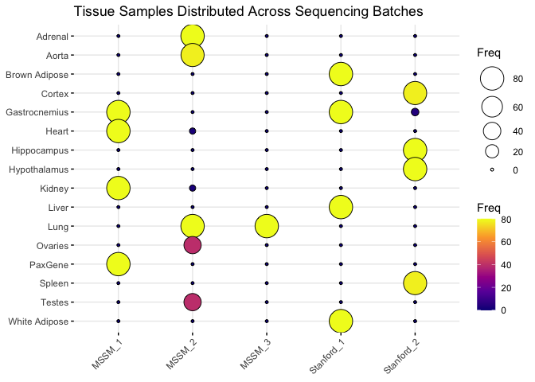

PASS1A (Rat) RNA-Seq Data: Batch Effects
================
Alec Steep and Jiayu Zhang
20200325

## Goals of Analysis

  - TODO: Add Step-by-step goals of analysis
  - Examine if data demonstrate technical batch fffects:
      - Sequencing batch (sequence date and location)
  - Examine if data demonstrate biological batch effects:
      - Influence from time of day and circadian rhythm
      - Influence from feeding
schedules

## Setup the Environment

``` r
################################################################################
##### Resources and Dependencies ###############################################
################################################################################

# Set the working directory
WD <- '/Volumes/Frishman_4TB/motrpac/20200309_rna-seq_steep'
#setwd(WD)

# Load the dependencies
#source("https://bioconductor.org/biocLite.R")
#BiocManager::install("org.Rn.eg.db")
#install.packages("tidyverse")

# Load dependencies
pacs...man <- c("tidyverse","GenomicRanges", "DESeq2","devtools","rafalib","GO.db","vsn","hexbin","ggplot2",
                "GenomicFeatures","Biostrings","BSgenome","AnnotationHub","plyr","dplyr",
                "org.Rn.eg.db","pheatmap","sva","formula.tools","pathview","biomaRt","feather",
                "PROPER","SeqGSEA",'purrr','BioInstaller','RColorBrewer','lubridate', "hms","ggpubr", "ggrepel")
lapply(pacs...man, FUN = function(X) {
        do.call("library", list(X)) })
```

    ## [[1]]
    ##  [1] "forcats"   "stringr"   "dplyr"     "purrr"     "readr"     "tidyr"    
    ##  [7] "tibble"    "ggplot2"   "tidyverse" "stats"     "graphics"  "grDevices"
    ## [13] "utils"     "datasets"  "methods"   "base"     
    ## 
    ## [[2]]
    ##  [1] "GenomicRanges" "GenomeInfoDb"  "IRanges"       "S4Vectors"    
    ##  [5] "BiocGenerics"  "parallel"      "stats4"        "forcats"      
    ##  [9] "stringr"       "dplyr"         "purrr"         "readr"        
    ## [13] "tidyr"         "tibble"        "ggplot2"       "tidyverse"    
    ## [17] "stats"         "graphics"      "grDevices"     "utils"        
    ## [21] "datasets"      "methods"       "base"         
    ## 
    ## [[3]]
    ##  [1] "DESeq2"               "SummarizedExperiment" "DelayedArray"        
    ##  [4] "BiocParallel"         "matrixStats"          "Biobase"             
    ##  [7] "GenomicRanges"        "GenomeInfoDb"         "IRanges"             
    ## [10] "S4Vectors"            "BiocGenerics"         "parallel"            
    ## [13] "stats4"               "forcats"              "stringr"             
    ## [16] "dplyr"                "purrr"                "readr"               
    ## [19] "tidyr"                "tibble"               "ggplot2"             
    ## [22] "tidyverse"            "stats"                "graphics"            
    ## [25] "grDevices"            "utils"                "datasets"            
    ## [28] "methods"              "base"                
    ## 
    ## [[4]]
    ##  [1] "devtools"             "usethis"              "DESeq2"              
    ##  [4] "SummarizedExperiment" "DelayedArray"         "BiocParallel"        
    ##  [7] "matrixStats"          "Biobase"              "GenomicRanges"       
    ## [10] "GenomeInfoDb"         "IRanges"              "S4Vectors"           
    ## [13] "BiocGenerics"         "parallel"             "stats4"              
    ## [16] "forcats"              "stringr"              "dplyr"               
    ## [19] "purrr"                "readr"                "tidyr"               
    ## [22] "tibble"               "ggplot2"              "tidyverse"           
    ## [25] "stats"                "graphics"             "grDevices"           
    ## [28] "utils"                "datasets"             "methods"             
    ## [31] "base"                
    ## 
    ## [[5]]
    ##  [1] "rafalib"              "devtools"             "usethis"             
    ##  [4] "DESeq2"               "SummarizedExperiment" "DelayedArray"        
    ##  [7] "BiocParallel"         "matrixStats"          "Biobase"             
    ## [10] "GenomicRanges"        "GenomeInfoDb"         "IRanges"             
    ## [13] "S4Vectors"            "BiocGenerics"         "parallel"            
    ## [16] "stats4"               "forcats"              "stringr"             
    ## [19] "dplyr"                "purrr"                "readr"               
    ## [22] "tidyr"                "tibble"               "ggplot2"             
    ## [25] "tidyverse"            "stats"                "graphics"            
    ## [28] "grDevices"            "utils"                "datasets"            
    ## [31] "methods"              "base"                
    ## 
    ## [[6]]
    ##  [1] "GO.db"                "AnnotationDbi"        "rafalib"             
    ##  [4] "devtools"             "usethis"              "DESeq2"              
    ##  [7] "SummarizedExperiment" "DelayedArray"         "BiocParallel"        
    ## [10] "matrixStats"          "Biobase"              "GenomicRanges"       
    ## [13] "GenomeInfoDb"         "IRanges"              "S4Vectors"           
    ## [16] "BiocGenerics"         "parallel"             "stats4"              
    ## [19] "forcats"              "stringr"              "dplyr"               
    ## [22] "purrr"                "readr"                "tidyr"               
    ## [25] "tibble"               "ggplot2"              "tidyverse"           
    ## [28] "stats"                "graphics"             "grDevices"           
    ## [31] "utils"                "datasets"             "methods"             
    ## [34] "base"                
    ## 
    ## [[7]]
    ##  [1] "vsn"                  "GO.db"                "AnnotationDbi"       
    ##  [4] "rafalib"              "devtools"             "usethis"             
    ##  [7] "DESeq2"               "SummarizedExperiment" "DelayedArray"        
    ## [10] "BiocParallel"         "matrixStats"          "Biobase"             
    ## [13] "GenomicRanges"        "GenomeInfoDb"         "IRanges"             
    ## [16] "S4Vectors"            "BiocGenerics"         "parallel"            
    ## [19] "stats4"               "forcats"              "stringr"             
    ## [22] "dplyr"                "purrr"                "readr"               
    ## [25] "tidyr"                "tibble"               "ggplot2"             
    ## [28] "tidyverse"            "stats"                "graphics"            
    ## [31] "grDevices"            "utils"                "datasets"            
    ## [34] "methods"              "base"                
    ## 
    ## [[8]]
    ##  [1] "hexbin"               "vsn"                  "GO.db"               
    ##  [4] "AnnotationDbi"        "rafalib"              "devtools"            
    ##  [7] "usethis"              "DESeq2"               "SummarizedExperiment"
    ## [10] "DelayedArray"         "BiocParallel"         "matrixStats"         
    ## [13] "Biobase"              "GenomicRanges"        "GenomeInfoDb"        
    ## [16] "IRanges"              "S4Vectors"            "BiocGenerics"        
    ## [19] "parallel"             "stats4"               "forcats"             
    ## [22] "stringr"              "dplyr"                "purrr"               
    ## [25] "readr"                "tidyr"                "tibble"              
    ## [28] "ggplot2"              "tidyverse"            "stats"               
    ## [31] "graphics"             "grDevices"            "utils"               
    ## [34] "datasets"             "methods"              "base"                
    ## 
    ## [[9]]
    ##  [1] "hexbin"               "vsn"                  "GO.db"               
    ##  [4] "AnnotationDbi"        "rafalib"              "devtools"            
    ##  [7] "usethis"              "DESeq2"               "SummarizedExperiment"
    ## [10] "DelayedArray"         "BiocParallel"         "matrixStats"         
    ## [13] "Biobase"              "GenomicRanges"        "GenomeInfoDb"        
    ## [16] "IRanges"              "S4Vectors"            "BiocGenerics"        
    ## [19] "parallel"             "stats4"               "forcats"             
    ## [22] "stringr"              "dplyr"                "purrr"               
    ## [25] "readr"                "tidyr"                "tibble"              
    ## [28] "ggplot2"              "tidyverse"            "stats"               
    ## [31] "graphics"             "grDevices"            "utils"               
    ## [34] "datasets"             "methods"              "base"                
    ## 
    ## [[10]]
    ##  [1] "GenomicFeatures"      "hexbin"               "vsn"                 
    ##  [4] "GO.db"                "AnnotationDbi"        "rafalib"             
    ##  [7] "devtools"             "usethis"              "DESeq2"              
    ## [10] "SummarizedExperiment" "DelayedArray"         "BiocParallel"        
    ## [13] "matrixStats"          "Biobase"              "GenomicRanges"       
    ## [16] "GenomeInfoDb"         "IRanges"              "S4Vectors"           
    ## [19] "BiocGenerics"         "parallel"             "stats4"              
    ## [22] "forcats"              "stringr"              "dplyr"               
    ## [25] "purrr"                "readr"                "tidyr"               
    ## [28] "tibble"               "ggplot2"              "tidyverse"           
    ## [31] "stats"                "graphics"             "grDevices"           
    ## [34] "utils"                "datasets"             "methods"             
    ## [37] "base"                
    ## 
    ## [[11]]
    ##  [1] "Biostrings"           "XVector"              "GenomicFeatures"     
    ##  [4] "hexbin"               "vsn"                  "GO.db"               
    ##  [7] "AnnotationDbi"        "rafalib"              "devtools"            
    ## [10] "usethis"              "DESeq2"               "SummarizedExperiment"
    ## [13] "DelayedArray"         "BiocParallel"         "matrixStats"         
    ## [16] "Biobase"              "GenomicRanges"        "GenomeInfoDb"        
    ## [19] "IRanges"              "S4Vectors"            "BiocGenerics"        
    ## [22] "parallel"             "stats4"               "forcats"             
    ## [25] "stringr"              "dplyr"                "purrr"               
    ## [28] "readr"                "tidyr"                "tibble"              
    ## [31] "ggplot2"              "tidyverse"            "stats"               
    ## [34] "graphics"             "grDevices"            "utils"               
    ## [37] "datasets"             "methods"              "base"                
    ## 
    ## [[12]]
    ##  [1] "BSgenome"             "rtracklayer"          "Biostrings"          
    ##  [4] "XVector"              "GenomicFeatures"      "hexbin"              
    ##  [7] "vsn"                  "GO.db"                "AnnotationDbi"       
    ## [10] "rafalib"              "devtools"             "usethis"             
    ## [13] "DESeq2"               "SummarizedExperiment" "DelayedArray"        
    ## [16] "BiocParallel"         "matrixStats"          "Biobase"             
    ## [19] "GenomicRanges"        "GenomeInfoDb"         "IRanges"             
    ## [22] "S4Vectors"            "BiocGenerics"         "parallel"            
    ## [25] "stats4"               "forcats"              "stringr"             
    ## [28] "dplyr"                "purrr"                "readr"               
    ## [31] "tidyr"                "tibble"               "ggplot2"             
    ## [34] "tidyverse"            "stats"                "graphics"            
    ## [37] "grDevices"            "utils"                "datasets"            
    ## [40] "methods"              "base"                
    ## 
    ## [[13]]
    ##  [1] "AnnotationHub"        "BiocFileCache"        "dbplyr"              
    ##  [4] "BSgenome"             "rtracklayer"          "Biostrings"          
    ##  [7] "XVector"              "GenomicFeatures"      "hexbin"              
    ## [10] "vsn"                  "GO.db"                "AnnotationDbi"       
    ## [13] "rafalib"              "devtools"             "usethis"             
    ## [16] "DESeq2"               "SummarizedExperiment" "DelayedArray"        
    ## [19] "BiocParallel"         "matrixStats"          "Biobase"             
    ## [22] "GenomicRanges"        "GenomeInfoDb"         "IRanges"             
    ## [25] "S4Vectors"            "BiocGenerics"         "parallel"            
    ## [28] "stats4"               "forcats"              "stringr"             
    ## [31] "dplyr"                "purrr"                "readr"               
    ## [34] "tidyr"                "tibble"               "ggplot2"             
    ## [37] "tidyverse"            "stats"                "graphics"            
    ## [40] "grDevices"            "utils"                "datasets"            
    ## [43] "methods"              "base"                
    ## 
    ## [[14]]
    ##  [1] "plyr"                 "AnnotationHub"        "BiocFileCache"       
    ##  [4] "dbplyr"               "BSgenome"             "rtracklayer"         
    ##  [7] "Biostrings"           "XVector"              "GenomicFeatures"     
    ## [10] "hexbin"               "vsn"                  "GO.db"               
    ## [13] "AnnotationDbi"        "rafalib"              "devtools"            
    ## [16] "usethis"              "DESeq2"               "SummarizedExperiment"
    ## [19] "DelayedArray"         "BiocParallel"         "matrixStats"         
    ## [22] "Biobase"              "GenomicRanges"        "GenomeInfoDb"        
    ## [25] "IRanges"              "S4Vectors"            "BiocGenerics"        
    ## [28] "parallel"             "stats4"               "forcats"             
    ## [31] "stringr"              "dplyr"                "purrr"               
    ## [34] "readr"                "tidyr"                "tibble"              
    ## [37] "ggplot2"              "tidyverse"            "stats"               
    ## [40] "graphics"             "grDevices"            "utils"               
    ## [43] "datasets"             "methods"              "base"                
    ## 
    ## [[15]]
    ##  [1] "plyr"                 "AnnotationHub"        "BiocFileCache"       
    ##  [4] "dbplyr"               "BSgenome"             "rtracklayer"         
    ##  [7] "Biostrings"           "XVector"              "GenomicFeatures"     
    ## [10] "hexbin"               "vsn"                  "GO.db"               
    ## [13] "AnnotationDbi"        "rafalib"              "devtools"            
    ## [16] "usethis"              "DESeq2"               "SummarizedExperiment"
    ## [19] "DelayedArray"         "BiocParallel"         "matrixStats"         
    ## [22] "Biobase"              "GenomicRanges"        "GenomeInfoDb"        
    ## [25] "IRanges"              "S4Vectors"            "BiocGenerics"        
    ## [28] "parallel"             "stats4"               "forcats"             
    ## [31] "stringr"              "dplyr"                "purrr"               
    ## [34] "readr"                "tidyr"                "tibble"              
    ## [37] "ggplot2"              "tidyverse"            "stats"               
    ## [40] "graphics"             "grDevices"            "utils"               
    ## [43] "datasets"             "methods"              "base"                
    ## 
    ## [[16]]
    ##  [1] "org.Rn.eg.db"         "plyr"                 "AnnotationHub"       
    ##  [4] "BiocFileCache"        "dbplyr"               "BSgenome"            
    ##  [7] "rtracklayer"          "Biostrings"           "XVector"             
    ## [10] "GenomicFeatures"      "hexbin"               "vsn"                 
    ## [13] "GO.db"                "AnnotationDbi"        "rafalib"             
    ## [16] "devtools"             "usethis"              "DESeq2"              
    ## [19] "SummarizedExperiment" "DelayedArray"         "BiocParallel"        
    ## [22] "matrixStats"          "Biobase"              "GenomicRanges"       
    ## [25] "GenomeInfoDb"         "IRanges"              "S4Vectors"           
    ## [28] "BiocGenerics"         "parallel"             "stats4"              
    ## [31] "forcats"              "stringr"              "dplyr"               
    ## [34] "purrr"                "readr"                "tidyr"               
    ## [37] "tibble"               "ggplot2"              "tidyverse"           
    ## [40] "stats"                "graphics"             "grDevices"           
    ## [43] "utils"                "datasets"             "methods"             
    ## [46] "base"                
    ## 
    ## [[17]]
    ##  [1] "pheatmap"             "org.Rn.eg.db"         "plyr"                
    ##  [4] "AnnotationHub"        "BiocFileCache"        "dbplyr"              
    ##  [7] "BSgenome"             "rtracklayer"          "Biostrings"          
    ## [10] "XVector"              "GenomicFeatures"      "hexbin"              
    ## [13] "vsn"                  "GO.db"                "AnnotationDbi"       
    ## [16] "rafalib"              "devtools"             "usethis"             
    ## [19] "DESeq2"               "SummarizedExperiment" "DelayedArray"        
    ## [22] "BiocParallel"         "matrixStats"          "Biobase"             
    ## [25] "GenomicRanges"        "GenomeInfoDb"         "IRanges"             
    ## [28] "S4Vectors"            "BiocGenerics"         "parallel"            
    ## [31] "stats4"               "forcats"              "stringr"             
    ## [34] "dplyr"                "purrr"                "readr"               
    ## [37] "tidyr"                "tibble"               "ggplot2"             
    ## [40] "tidyverse"            "stats"                "graphics"            
    ## [43] "grDevices"            "utils"                "datasets"            
    ## [46] "methods"              "base"                
    ## 
    ## [[18]]
    ##  [1] "sva"                  "genefilter"           "mgcv"                
    ##  [4] "nlme"                 "pheatmap"             "org.Rn.eg.db"        
    ##  [7] "plyr"                 "AnnotationHub"        "BiocFileCache"       
    ## [10] "dbplyr"               "BSgenome"             "rtracklayer"         
    ## [13] "Biostrings"           "XVector"              "GenomicFeatures"     
    ## [16] "hexbin"               "vsn"                  "GO.db"               
    ## [19] "AnnotationDbi"        "rafalib"              "devtools"            
    ## [22] "usethis"              "DESeq2"               "SummarizedExperiment"
    ## [25] "DelayedArray"         "BiocParallel"         "matrixStats"         
    ## [28] "Biobase"              "GenomicRanges"        "GenomeInfoDb"        
    ## [31] "IRanges"              "S4Vectors"            "BiocGenerics"        
    ## [34] "parallel"             "stats4"               "forcats"             
    ## [37] "stringr"              "dplyr"                "purrr"               
    ## [40] "readr"                "tidyr"                "tibble"              
    ## [43] "ggplot2"              "tidyverse"            "stats"               
    ## [46] "graphics"             "grDevices"            "utils"               
    ## [49] "datasets"             "methods"              "base"                
    ## 
    ## [[19]]
    ##  [1] "formula.tools"        "sva"                  "genefilter"          
    ##  [4] "mgcv"                 "nlme"                 "pheatmap"            
    ##  [7] "org.Rn.eg.db"         "plyr"                 "AnnotationHub"       
    ## [10] "BiocFileCache"        "dbplyr"               "BSgenome"            
    ## [13] "rtracklayer"          "Biostrings"           "XVector"             
    ## [16] "GenomicFeatures"      "hexbin"               "vsn"                 
    ## [19] "GO.db"                "AnnotationDbi"        "rafalib"             
    ## [22] "devtools"             "usethis"              "DESeq2"              
    ## [25] "SummarizedExperiment" "DelayedArray"         "BiocParallel"        
    ## [28] "matrixStats"          "Biobase"              "GenomicRanges"       
    ## [31] "GenomeInfoDb"         "IRanges"              "S4Vectors"           
    ## [34] "BiocGenerics"         "parallel"             "stats4"              
    ## [37] "forcats"              "stringr"              "dplyr"               
    ## [40] "purrr"                "readr"                "tidyr"               
    ## [43] "tibble"               "ggplot2"              "tidyverse"           
    ## [46] "stats"                "graphics"             "grDevices"           
    ## [49] "utils"                "datasets"             "methods"             
    ## [52] "base"                
    ## 
    ## [[20]]
    ##  [1] "pathview"             "org.Hs.eg.db"         "formula.tools"       
    ##  [4] "sva"                  "genefilter"           "mgcv"                
    ##  [7] "nlme"                 "pheatmap"             "org.Rn.eg.db"        
    ## [10] "plyr"                 "AnnotationHub"        "BiocFileCache"       
    ## [13] "dbplyr"               "BSgenome"             "rtracklayer"         
    ## [16] "Biostrings"           "XVector"              "GenomicFeatures"     
    ## [19] "hexbin"               "vsn"                  "GO.db"               
    ## [22] "AnnotationDbi"        "rafalib"              "devtools"            
    ## [25] "usethis"              "DESeq2"               "SummarizedExperiment"
    ## [28] "DelayedArray"         "BiocParallel"         "matrixStats"         
    ## [31] "Biobase"              "GenomicRanges"        "GenomeInfoDb"        
    ## [34] "IRanges"              "S4Vectors"            "BiocGenerics"        
    ## [37] "parallel"             "stats4"               "forcats"             
    ## [40] "stringr"              "dplyr"                "purrr"               
    ## [43] "readr"                "tidyr"                "tibble"              
    ## [46] "ggplot2"              "tidyverse"            "stats"               
    ## [49] "graphics"             "grDevices"            "utils"               
    ## [52] "datasets"             "methods"              "base"                
    ## 
    ## [[21]]
    ##  [1] "biomaRt"              "pathview"             "org.Hs.eg.db"        
    ##  [4] "formula.tools"        "sva"                  "genefilter"          
    ##  [7] "mgcv"                 "nlme"                 "pheatmap"            
    ## [10] "org.Rn.eg.db"         "plyr"                 "AnnotationHub"       
    ## [13] "BiocFileCache"        "dbplyr"               "BSgenome"            
    ## [16] "rtracklayer"          "Biostrings"           "XVector"             
    ## [19] "GenomicFeatures"      "hexbin"               "vsn"                 
    ## [22] "GO.db"                "AnnotationDbi"        "rafalib"             
    ## [25] "devtools"             "usethis"              "DESeq2"              
    ## [28] "SummarizedExperiment" "DelayedArray"         "BiocParallel"        
    ## [31] "matrixStats"          "Biobase"              "GenomicRanges"       
    ## [34] "GenomeInfoDb"         "IRanges"              "S4Vectors"           
    ## [37] "BiocGenerics"         "parallel"             "stats4"              
    ## [40] "forcats"              "stringr"              "dplyr"               
    ## [43] "purrr"                "readr"                "tidyr"               
    ## [46] "tibble"               "ggplot2"              "tidyverse"           
    ## [49] "stats"                "graphics"             "grDevices"           
    ## [52] "utils"                "datasets"             "methods"             
    ## [55] "base"                
    ## 
    ## [[22]]
    ##  [1] "feather"              "biomaRt"              "pathview"            
    ##  [4] "org.Hs.eg.db"         "formula.tools"        "sva"                 
    ##  [7] "genefilter"           "mgcv"                 "nlme"                
    ## [10] "pheatmap"             "org.Rn.eg.db"         "plyr"                
    ## [13] "AnnotationHub"        "BiocFileCache"        "dbplyr"              
    ## [16] "BSgenome"             "rtracklayer"          "Biostrings"          
    ## [19] "XVector"              "GenomicFeatures"      "hexbin"              
    ## [22] "vsn"                  "GO.db"                "AnnotationDbi"       
    ## [25] "rafalib"              "devtools"             "usethis"             
    ## [28] "DESeq2"               "SummarizedExperiment" "DelayedArray"        
    ## [31] "BiocParallel"         "matrixStats"          "Biobase"             
    ## [34] "GenomicRanges"        "GenomeInfoDb"         "IRanges"             
    ## [37] "S4Vectors"            "BiocGenerics"         "parallel"            
    ## [40] "stats4"               "forcats"              "stringr"             
    ## [43] "dplyr"                "purrr"                "readr"               
    ## [46] "tidyr"                "tibble"               "ggplot2"             
    ## [49] "tidyverse"            "stats"                "graphics"            
    ## [52] "grDevices"            "utils"                "datasets"            
    ## [55] "methods"              "base"                
    ## 
    ## [[23]]
    ##  [1] "PROPER"               "feather"              "biomaRt"             
    ##  [4] "pathview"             "org.Hs.eg.db"         "formula.tools"       
    ##  [7] "sva"                  "genefilter"           "mgcv"                
    ## [10] "nlme"                 "pheatmap"             "org.Rn.eg.db"        
    ## [13] "plyr"                 "AnnotationHub"        "BiocFileCache"       
    ## [16] "dbplyr"               "BSgenome"             "rtracklayer"         
    ## [19] "Biostrings"           "XVector"              "GenomicFeatures"     
    ## [22] "hexbin"               "vsn"                  "GO.db"               
    ## [25] "AnnotationDbi"        "rafalib"              "devtools"            
    ## [28] "usethis"              "DESeq2"               "SummarizedExperiment"
    ## [31] "DelayedArray"         "BiocParallel"         "matrixStats"         
    ## [34] "Biobase"              "GenomicRanges"        "GenomeInfoDb"        
    ## [37] "IRanges"              "S4Vectors"            "BiocGenerics"        
    ## [40] "parallel"             "stats4"               "forcats"             
    ## [43] "stringr"              "dplyr"                "purrr"               
    ## [46] "readr"                "tidyr"                "tibble"              
    ## [49] "ggplot2"              "tidyverse"            "stats"               
    ## [52] "graphics"             "grDevices"            "utils"               
    ## [55] "datasets"             "methods"              "base"                
    ## 
    ## [[24]]
    ##  [1] "SeqGSEA"              "DESeq"                "lattice"             
    ##  [4] "locfit"               "doParallel"           "iterators"           
    ##  [7] "foreach"              "PROPER"               "feather"             
    ## [10] "biomaRt"              "pathview"             "org.Hs.eg.db"        
    ## [13] "formula.tools"        "sva"                  "genefilter"          
    ## [16] "mgcv"                 "nlme"                 "pheatmap"            
    ## [19] "org.Rn.eg.db"         "plyr"                 "AnnotationHub"       
    ## [22] "BiocFileCache"        "dbplyr"               "BSgenome"            
    ## [25] "rtracklayer"          "Biostrings"           "XVector"             
    ## [28] "GenomicFeatures"      "hexbin"               "vsn"                 
    ## [31] "GO.db"                "AnnotationDbi"        "rafalib"             
    ## [34] "devtools"             "usethis"              "DESeq2"              
    ## [37] "SummarizedExperiment" "DelayedArray"         "BiocParallel"        
    ## [40] "matrixStats"          "Biobase"              "GenomicRanges"       
    ## [43] "GenomeInfoDb"         "IRanges"              "S4Vectors"           
    ## [46] "BiocGenerics"         "parallel"             "stats4"              
    ## [49] "forcats"              "stringr"              "dplyr"               
    ## [52] "purrr"                "readr"                "tidyr"               
    ## [55] "tibble"               "ggplot2"              "tidyverse"           
    ## [58] "stats"                "graphics"             "grDevices"           
    ## [61] "utils"                "datasets"             "methods"             
    ## [64] "base"                
    ## 
    ## [[25]]
    ##  [1] "SeqGSEA"              "DESeq"                "lattice"             
    ##  [4] "locfit"               "doParallel"           "iterators"           
    ##  [7] "foreach"              "PROPER"               "feather"             
    ## [10] "biomaRt"              "pathview"             "org.Hs.eg.db"        
    ## [13] "formula.tools"        "sva"                  "genefilter"          
    ## [16] "mgcv"                 "nlme"                 "pheatmap"            
    ## [19] "org.Rn.eg.db"         "plyr"                 "AnnotationHub"       
    ## [22] "BiocFileCache"        "dbplyr"               "BSgenome"            
    ## [25] "rtracklayer"          "Biostrings"           "XVector"             
    ## [28] "GenomicFeatures"      "hexbin"               "vsn"                 
    ## [31] "GO.db"                "AnnotationDbi"        "rafalib"             
    ## [34] "devtools"             "usethis"              "DESeq2"              
    ## [37] "SummarizedExperiment" "DelayedArray"         "BiocParallel"        
    ## [40] "matrixStats"          "Biobase"              "GenomicRanges"       
    ## [43] "GenomeInfoDb"         "IRanges"              "S4Vectors"           
    ## [46] "BiocGenerics"         "parallel"             "stats4"              
    ## [49] "forcats"              "stringr"              "dplyr"               
    ## [52] "purrr"                "readr"                "tidyr"               
    ## [55] "tibble"               "ggplot2"              "tidyverse"           
    ## [58] "stats"                "graphics"             "grDevices"           
    ## [61] "utils"                "datasets"             "methods"             
    ## [64] "base"                
    ## 
    ## [[26]]
    ##  [1] "BioInstaller"         "SeqGSEA"              "DESeq"               
    ##  [4] "lattice"              "locfit"               "doParallel"          
    ##  [7] "iterators"            "foreach"              "PROPER"              
    ## [10] "feather"              "biomaRt"              "pathview"            
    ## [13] "org.Hs.eg.db"         "formula.tools"        "sva"                 
    ## [16] "genefilter"           "mgcv"                 "nlme"                
    ## [19] "pheatmap"             "org.Rn.eg.db"         "plyr"                
    ## [22] "AnnotationHub"        "BiocFileCache"        "dbplyr"              
    ## [25] "BSgenome"             "rtracklayer"          "Biostrings"          
    ## [28] "XVector"              "GenomicFeatures"      "hexbin"              
    ## [31] "vsn"                  "GO.db"                "AnnotationDbi"       
    ## [34] "rafalib"              "devtools"             "usethis"             
    ## [37] "DESeq2"               "SummarizedExperiment" "DelayedArray"        
    ## [40] "BiocParallel"         "matrixStats"          "Biobase"             
    ## [43] "GenomicRanges"        "GenomeInfoDb"         "IRanges"             
    ## [46] "S4Vectors"            "BiocGenerics"         "parallel"            
    ## [49] "stats4"               "forcats"              "stringr"             
    ## [52] "dplyr"                "purrr"                "readr"               
    ## [55] "tidyr"                "tibble"               "ggplot2"             
    ## [58] "tidyverse"            "stats"                "graphics"            
    ## [61] "grDevices"            "utils"                "datasets"            
    ## [64] "methods"              "base"                
    ## 
    ## [[27]]
    ##  [1] "RColorBrewer"         "BioInstaller"         "SeqGSEA"             
    ##  [4] "DESeq"                "lattice"              "locfit"              
    ##  [7] "doParallel"           "iterators"            "foreach"             
    ## [10] "PROPER"               "feather"              "biomaRt"             
    ## [13] "pathview"             "org.Hs.eg.db"         "formula.tools"       
    ## [16] "sva"                  "genefilter"           "mgcv"                
    ## [19] "nlme"                 "pheatmap"             "org.Rn.eg.db"        
    ## [22] "plyr"                 "AnnotationHub"        "BiocFileCache"       
    ## [25] "dbplyr"               "BSgenome"             "rtracklayer"         
    ## [28] "Biostrings"           "XVector"              "GenomicFeatures"     
    ## [31] "hexbin"               "vsn"                  "GO.db"               
    ## [34] "AnnotationDbi"        "rafalib"              "devtools"            
    ## [37] "usethis"              "DESeq2"               "SummarizedExperiment"
    ## [40] "DelayedArray"         "BiocParallel"         "matrixStats"         
    ## [43] "Biobase"              "GenomicRanges"        "GenomeInfoDb"        
    ## [46] "IRanges"              "S4Vectors"            "BiocGenerics"        
    ## [49] "parallel"             "stats4"               "forcats"             
    ## [52] "stringr"              "dplyr"                "purrr"               
    ## [55] "readr"                "tidyr"                "tibble"              
    ## [58] "ggplot2"              "tidyverse"            "stats"               
    ## [61] "graphics"             "grDevices"            "utils"               
    ## [64] "datasets"             "methods"              "base"                
    ## 
    ## [[28]]
    ##  [1] "lubridate"            "RColorBrewer"         "BioInstaller"        
    ##  [4] "SeqGSEA"              "DESeq"                "lattice"             
    ##  [7] "locfit"               "doParallel"           "iterators"           
    ## [10] "foreach"              "PROPER"               "feather"             
    ## [13] "biomaRt"              "pathview"             "org.Hs.eg.db"        
    ## [16] "formula.tools"        "sva"                  "genefilter"          
    ## [19] "mgcv"                 "nlme"                 "pheatmap"            
    ## [22] "org.Rn.eg.db"         "plyr"                 "AnnotationHub"       
    ## [25] "BiocFileCache"        "dbplyr"               "BSgenome"            
    ## [28] "rtracklayer"          "Biostrings"           "XVector"             
    ## [31] "GenomicFeatures"      "hexbin"               "vsn"                 
    ## [34] "GO.db"                "AnnotationDbi"        "rafalib"             
    ## [37] "devtools"             "usethis"              "DESeq2"              
    ## [40] "SummarizedExperiment" "DelayedArray"         "BiocParallel"        
    ## [43] "matrixStats"          "Biobase"              "GenomicRanges"       
    ## [46] "GenomeInfoDb"         "IRanges"              "S4Vectors"           
    ## [49] "BiocGenerics"         "parallel"             "stats4"              
    ## [52] "forcats"              "stringr"              "dplyr"               
    ## [55] "purrr"                "readr"                "tidyr"               
    ## [58] "tibble"               "ggplot2"              "tidyverse"           
    ## [61] "stats"                "graphics"             "grDevices"           
    ## [64] "utils"                "datasets"             "methods"             
    ## [67] "base"                
    ## 
    ## [[29]]
    ##  [1] "hms"                  "lubridate"            "RColorBrewer"        
    ##  [4] "BioInstaller"         "SeqGSEA"              "DESeq"               
    ##  [7] "lattice"              "locfit"               "doParallel"          
    ## [10] "iterators"            "foreach"              "PROPER"              
    ## [13] "feather"              "biomaRt"              "pathview"            
    ## [16] "org.Hs.eg.db"         "formula.tools"        "sva"                 
    ## [19] "genefilter"           "mgcv"                 "nlme"                
    ## [22] "pheatmap"             "org.Rn.eg.db"         "plyr"                
    ## [25] "AnnotationHub"        "BiocFileCache"        "dbplyr"              
    ## [28] "BSgenome"             "rtracklayer"          "Biostrings"          
    ## [31] "XVector"              "GenomicFeatures"      "hexbin"              
    ## [34] "vsn"                  "GO.db"                "AnnotationDbi"       
    ## [37] "rafalib"              "devtools"             "usethis"             
    ## [40] "DESeq2"               "SummarizedExperiment" "DelayedArray"        
    ## [43] "BiocParallel"         "matrixStats"          "Biobase"             
    ## [46] "GenomicRanges"        "GenomeInfoDb"         "IRanges"             
    ## [49] "S4Vectors"            "BiocGenerics"         "parallel"            
    ## [52] "stats4"               "forcats"              "stringr"             
    ## [55] "dplyr"                "purrr"                "readr"               
    ## [58] "tidyr"                "tibble"               "ggplot2"             
    ## [61] "tidyverse"            "stats"                "graphics"            
    ## [64] "grDevices"            "utils"                "datasets"            
    ## [67] "methods"              "base"                
    ## 
    ## [[30]]
    ##  [1] "ggpubr"               "magrittr"             "hms"                 
    ##  [4] "lubridate"            "RColorBrewer"         "BioInstaller"        
    ##  [7] "SeqGSEA"              "DESeq"                "lattice"             
    ## [10] "locfit"               "doParallel"           "iterators"           
    ## [13] "foreach"              "PROPER"               "feather"             
    ## [16] "biomaRt"              "pathview"             "org.Hs.eg.db"        
    ## [19] "formula.tools"        "sva"                  "genefilter"          
    ## [22] "mgcv"                 "nlme"                 "pheatmap"            
    ## [25] "org.Rn.eg.db"         "plyr"                 "AnnotationHub"       
    ## [28] "BiocFileCache"        "dbplyr"               "BSgenome"            
    ## [31] "rtracklayer"          "Biostrings"           "XVector"             
    ## [34] "GenomicFeatures"      "hexbin"               "vsn"                 
    ## [37] "GO.db"                "AnnotationDbi"        "rafalib"             
    ## [40] "devtools"             "usethis"              "DESeq2"              
    ## [43] "SummarizedExperiment" "DelayedArray"         "BiocParallel"        
    ## [46] "matrixStats"          "Biobase"              "GenomicRanges"       
    ## [49] "GenomeInfoDb"         "IRanges"              "S4Vectors"           
    ## [52] "BiocGenerics"         "parallel"             "stats4"              
    ## [55] "forcats"              "stringr"              "dplyr"               
    ## [58] "purrr"                "readr"                "tidyr"               
    ## [61] "tibble"               "ggplot2"              "tidyverse"           
    ## [64] "stats"                "graphics"             "grDevices"           
    ## [67] "utils"                "datasets"             "methods"             
    ## [70] "base"                
    ## 
    ## [[31]]
    ##  [1] "ggrepel"              "ggpubr"               "magrittr"            
    ##  [4] "hms"                  "lubridate"            "RColorBrewer"        
    ##  [7] "BioInstaller"         "SeqGSEA"              "DESeq"               
    ## [10] "lattice"              "locfit"               "doParallel"          
    ## [13] "iterators"            "foreach"              "PROPER"              
    ## [16] "feather"              "biomaRt"              "pathview"            
    ## [19] "org.Hs.eg.db"         "formula.tools"        "sva"                 
    ## [22] "genefilter"           "mgcv"                 "nlme"                
    ## [25] "pheatmap"             "org.Rn.eg.db"         "plyr"                
    ## [28] "AnnotationHub"        "BiocFileCache"        "dbplyr"              
    ## [31] "BSgenome"             "rtracklayer"          "Biostrings"          
    ## [34] "XVector"              "GenomicFeatures"      "hexbin"              
    ## [37] "vsn"                  "GO.db"                "AnnotationDbi"       
    ## [40] "rafalib"              "devtools"             "usethis"             
    ## [43] "DESeq2"               "SummarizedExperiment" "DelayedArray"        
    ## [46] "BiocParallel"         "matrixStats"          "Biobase"             
    ## [49] "GenomicRanges"        "GenomeInfoDb"         "IRanges"             
    ## [52] "S4Vectors"            "BiocGenerics"         "parallel"            
    ## [55] "stats4"               "forcats"              "stringr"             
    ## [58] "dplyr"                "purrr"                "readr"               
    ## [61] "tidyr"                "tibble"               "ggplot2"             
    ## [64] "tidyverse"            "stats"                "graphics"            
    ## [67] "grDevices"            "utils"                "datasets"            
    ## [70] "methods"              "base"

``` r
############################################################
##### Functions ############################################
############################################################

# Set select
select <- dplyr::select

# Make the 'not in' operator
################################################################################
'%!in%' <- function(x,y) {
        !('%in%'(x,y))
}
################################################################################

# Capture the Date and AUthor
################################################################################
date <- format.Date( Sys.Date(), '%Y%m%d' )
auth <- "steep"
################################################################################

## explicit gc, then execute `expr` `n` times w/o explicit gc, return timings
################################################################################
benchmark <- function(n = 1, expr, envir = parent.frame()) {
        expr <- substitute(expr)
        gc()
        map(seq_len(n), ~ system.time(eval(expr, envir), gcFirst = FALSE))
}
################################################################################

# Function to speed up making rows into lists for interation with lapply
################################################################################
f_pmap_aslist <- function(df) {
        purrr::pmap(as.list(df), list)
}
################################################################################
```

## Load & Clean Data

##### Data files to load:

  - RNA-Seq from Mt. Sanai
      - 3 sequencing batches & metadata
  - RNA-Seq from Stanford
      - 2 sequencing batches &
metadata

<!-- end list -->

``` r
################################################################################
#####     Load & Clean Data      ###############################################
################################################################################

# Mt Sanai RNASeq
###################################

# Sanai batch 1 read counts (320 samples)
sanai_1 <- read.table(file = paste0(WD,'/sinai/batch_1/summary/featureCounts.txt'), 
                      header = TRUE, sep = '\t', check.names = FALSE)
# Sanai batch 2 read counts (320 samples)
sanai_2 <- read.table(file = paste0(WD,'/sinai/batch_2/summary/featureCounts.txt'), 
                      header = TRUE, sep = '\t', check.names = FALSE)
# Sanai batch 3 read counts (80 samples)
sanai_3 <- read.table(file = paste0(WD,'/sinai/batch_3/summary/featureCounts.txt'), 
                      header = TRUE, sep = '\t', check.names = FALSE)

# Sanai batch 1 meta data
sanai_meta_1 <-  read.table(file = paste0(WD,'/sinai/batch_1/metadata/sample_metadata_20191010.csv'), 
                            header = TRUE, sep = ',', check.names = FALSE)
# Sanai batch 2 meta data
sanai_meta_2 <-  read.table(file = paste0(WD,'/sinai/batch_2/metadata/sample_metadata_20191010.csv'), 
                            header = TRUE, sep = ',', check.names = FALSE)
# Sanai batch 3 meta data
sanai_meta_3 <-  read.table(file = paste0(WD,'/sinai/batch_3/metadata/sample_metadata_20191010.csv'), 
                            header = TRUE, sep = ',', check.names = FALSE)

# Stanford RNASeq
###################################

# Stanford batch 1 read counts (320 samples)
sford_1 <- read.table(file = paste0(WD,'/stanford/batch_1/summary/rsem_genes_count.txt'), 
                      header = TRUE, sep = '\t', check.names = FALSE)
# Stanford batch 2 read counts (320 samples)
sford_2 <- read.table(file = paste0(WD,'/stanford/batch_2/summary/featureCounts.txt'), 
                      header = TRUE, sep = '\t', check.names = FALSE)

# Stanford batch 1 meta data
sford_meta_1 <-  read.table(file = paste0(WD,'/stanford/batch_1/metadata/sample_metadata_20191010.csv'), 
                            header = TRUE, sep = ',', check.names = FALSE)
# Stanford batch 2 meta data
sford_meta_2 <-  read.table(file = paste0(WD,'/stanford/batch_2/metadata/sample_metadata_20191010.csv'), 
                            header = TRUE, sep = ',', check.names = FALSE)
# Determine sequencing location and batch (batch by date)
#str(sford_meta_1)
#str(sford_meta_2)
#str(sanai_meta_3)

# Location under GET_site variable
#summary(sford_meta_2$GET_site)
#summary(sford_meta_2$GET_site)
#summary(sanai_meta_1$GET_site)
#summary(sanai_meta_2$GET_site)
#summary(sanai_meta_3$GET_site)

# Date (batch) under Seq_date variable
#unique(sford_meta_1$Seq_date)
#unique(sford_meta_2$Seq_date)
#unique(sanai_meta_1$Seq_date)
#unique(sanai_meta_2$Seq_date)
#unique(sanai_meta_3$Seq_date)

# Are the combination of these values unique?
#sford_meta_1 %>% 
#        select(vial_label, GET_site, Seq_date) %>%
#        unique() %>% dim()
#sford_meta_2 %>% 
#        select(vial_label, GET_site, Seq_date) %>%
#        unique() %>% dim()
#sanai_meta_1 %>% 
#        select(vial_label, GET_site, Seq_date) %>%
#        unique() %>% dim()
#sanai_meta_2 %>% 
#        select(vial_label, GET_site, Seq_date) %>%
#        unique() %>% dim()
#sanai_meta_3 %>% 
#        select(vial_label, GET_site, Seq_date) %>%
#        unique() %>% dim()

# Combine the Stanford and Mt. Sanai Data
##########################################
# Count Matrixes

# Add custom annotation to column names
colnames(sanai_1) <- paste0(colnames(sanai_1),'_SN1')
colnames(sanai_2) <- paste0(colnames(sanai_2),'_SN2')
colnames(sanai_3) <- paste0(colnames(sanai_3),'_SN3')
colnames(sford_1) <- paste0(colnames(sford_1),'_SF1')
colnames(sford_2) <- paste0(colnames(sford_2),'_SF2')
sanai_meta_1$sample_key <- paste0(sanai_meta_1$vial_label, '_SN1')
sanai_meta_2$sample_key <- paste0(sanai_meta_2$vial_label, '_SN2')
sanai_meta_3$sample_key <- paste0(sanai_meta_3$vial_label, '_SN3')
sford_meta_1$sample_key <- paste0(sford_meta_1$vial_label, '_SF1')
sford_meta_2$sample_key <- paste0(sford_meta_2$vial_label, '_SF2')

# Combine counts
all.data.m <- cbind(sanai_1[,-1], sanai_2[,-1], sanai_3[,-1], sford_1[,-1], sford_2[,-1] ) %>% as.matrix()
rownames(all.data.m) <- sanai_1[,1]
# Convert counts to integers
mode(all.data.m) <- "integer"

# Combine metadata (convert factors to characters to prevent error)
sanai_meta_1 <- data.frame(lapply(sanai_meta_1, as.character), stringsAsFactors=FALSE)
sanai_meta_2 <- data.frame(lapply(sanai_meta_2, as.character), stringsAsFactors=FALSE)
sanai_meta_3 <- data.frame(lapply(sanai_meta_3, as.character), stringsAsFactors=FALSE)
sford_meta_1 <- data.frame(lapply(sford_meta_1, as.character), stringsAsFactors=FALSE)
sford_meta_2 <- data.frame(lapply(sford_meta_2, as.character), stringsAsFactors=FALSE)
meta <- bind_rows(sanai_meta_1, sanai_meta_2, sanai_meta_3, sford_meta_1, sford_meta_2)

# Double check unique values
#dim(meta)
#meta %>% 
#        select(vial_label, GET_site, Seq_date) %>%
#        unique() %>% dim()

# General Phenotype Data
##################################
pheno_file <- paste0(WD,'/../phenotype/merged/merged_dmaqc_data2019-10-13.txt')
gen_pheno <- read.table(file = pheno_file, header = TRUE, sep = '\t', check.names = FALSE) %>% 
        as_tibble()

# Adjust column objects
########################
meta$vial_label <- as.factor(meta$vial_label)

# Adjust column objects
########################
# To factors
factor_cols <- c("labelid",
                 "viallabel",
                 "animal.registration.sex")
for(fc in factor_cols){
        gen_pheno[[fc]] <- as.factor(gen_pheno[[fc]])
}

# To Dates: 03JUL2018
date_cols <- c("acute.test.d_visit",
               "acute.test.d_start",
               "animal.familiarization.d_visit",
               "animal.familiarization.d_treadmillbegin",
               "animal.familiarization.d_treadmillcomplete",
               "animal.registration.d_visit",
               "animal.registration.d_arrive",
               "animal.registration.d_reverselight",
               "specimen.collection.d_visit")
for(dc in date_cols){
        gen_pheno[[dc]] <- dmy(gen_pheno[[dc]])
}
# To Dates: Jan 2018 
gen_pheno <- gen_pheno %>%
        mutate(animal.registration.d_birth = dmy(paste0('1 ',animal.registration.d_birth)))

# To Times: 10:30:00
time_cols <- c("acute.test.t_complete",
               "specimen.collection.t_anesthesia",
               "specimen.collection.t_bloodstart",
               "specimen.collection.t_bloodstop",
               "specimen.collection.t_edtafill",
               "specimen.collection.uteruscomplete",
               "specimen.collection.t_uterusstart",
               "specimen.collection.t_uterusstop",
               "specimen.collection.t_death",
               "specimen.processing.t_collection",
               "specimen.processing.t_edtaspin",
               "specimen.processing.t_freeze")
for(tc in time_cols){
        gen_pheno[[tc]] <- gen_pheno[[tc]] %>% as.character() %>% parse_time()
}

# To Times: 01:21
gen_pheno <- gen_pheno %>%
        mutate(acute.test.howlongshock = 
                       ifelse((gen_pheno$acute.test.howlongshock != ''), paste0('00:',acute.test.howlongshock), '00:00:00'))
gen_pheno$acute.test.howlongshock <- parse_time(gen_pheno$acute.test.howlongshock)

# Adjust labels within columns (e.g. 1 and 2 to female and male)
# see ../phenotype/merged/20191013_merged-column-dictionary_steep-edits.xlsx
########################
gen_pheno <- gen_pheno %>%
        mutate(animal.registration.sex = 
                       case_when(animal.registration.sex == '1' ~ 'Female',
                                 animal.registration.sex == '2' ~ 'Male'))
gen_pheno$animal.registration.sex <- as.factor(gen_pheno$animal.registration.sex)
```

## Incorporate Annotation from Phenotypic Data

``` r
################################################################################
######### Incorporate Phenotypic Annotations ###################################
################################################################################

# Replace the name of the vial label column (for sake of join)
names(gen_pheno) <- str_replace(names(gen_pheno), 'viallabel', 'vial_label')

# To investigate if the "vial_label" key is indeed unique
#meta$vial_label %>% length()
#meta$vial_label %>% unique %>% length()
#gen_pheno$vial_label %>% length()
#gen_pheno$vial_label %>% unique %>% length()

# Perform a left join to incorporate phenotypic information
status <- left_join(meta, gen_pheno, by = 'vial_label') %>% as.data.frame()
#dim(status)

# Adjust objects in columns as needed

# Create new columns
status <- status %>% 
        mutate(Seq_batch = 
                       case_when((GET_site == 'Stanford' & Seq_date == '190426') ~ "Stanford_1",
                                 (GET_site == 'Stanford' & Seq_date == '190703') ~ "Stanford_2",
                                 (GET_site == 'MSSM' & Seq_date == '190409') ~ "MSSM_1",
                                 (GET_site == 'MSSM' & Seq_date == '190626') ~ "MSSM_2",
                                 (GET_site == 'MSSM' & Seq_date == '190723') ~ "MSSM_3")
               )
#table(status$Seq_batch)

# To factors
factor_cols <- c("sample_key",
                 "Seq_batch")
for(fc in factor_cols){
        status[[fc]] <- as.factor(status[[fc]])
}

# "It is absolutely critical that the columns of the count matrix and the rows of the 
# column data (information about samples) are in the same order. DESeq2 will not make 
# guesses as to which column of the count matrix belongs to which row of the column data, 
# these must be provided to DESeq2 already in consistent order." ~ Mike Love

# TODO: Come back and figure out about missing samples and annotation

# Make sure that all values in status "sample_key" are unique
#status$sample_key %>% length()
#status$sample_key %>% unique %>% length()
# Make sure that all columns in counts matrix are unique
#colnames(all.data.m) %>% length()
#colnames(all.data.m) %>% unique %>% length()

rownames(status) <- status$sample_key
#all(rownames(status) %in% colnames(all.data.m))
#all(colnames(all.data.m) %in% rownames(status))
#all(rownames(status) == colnames(all.data.m))
all.data.m <- all.data.m[, rownames(status)]
```

#### Sanity Check: Ensure that the metadata rownames are identical to count matrix column names

``` r
all(rownames(status) == colnames(all.data.m))
```

    ## [1] TRUE

#### Data can easily be formatted for BioJupies if desired

\#+
BioJupies

``` r
##########################################################################
############ Annotate Data for BioJupies #################################
##########################################################################
# Annotate Data for BioJupies
# Annotate normalized counts
#biojupes <- all.data
#biojupes$ensembl <- rownames(biojupes)
#biojupes$symbol <- mapIds(org.Gg.eg.db, biojupes$ensembl, "SYMBOL", "ENSEMBL")
#biojupes <- biojupes[!duplicated(biojupes$symbol),]
#biojupes <- biojupes[!is.na(biojupes$symbol),]
#rownames(biojupes) <- biojupes$symbol
#biojupes <- biojupes %>% dplyr::select(symbol, everything())
#biojupes <- biojupes %>% dplyr::select(-ensembl)
#write.table(biojupes, file = paste0('./data/',date,'_biojupiesmatrix_steep.txt'), quote = FALSE, row.names = FALSE, sep = '\t')
##########################################################################
```

## PCA Visualization of Sequencing Batches (Unsupervised)

TODO: Generate a summary of major
inferences

``` r
##########################################################################
############ PCA Sequencing Batches (Unsupervised) #######################
##########################################################################

# Perform unsupervised clustering
# Build model
count_data <- all.data.m
col_data <- status # To look at all samples 
design = ~ 1 # Primary variable needs to be last
title = paste0('Design: ',as.character(design))
# Create a DESeqDataSet Object
dds <- DESeqDataSetFromMatrix(countData = count_data,
                              colData = col_data,
                              design = design)

# Perform pre-filtering.
# Filter genes with average count of 10 or less.
# Reasoning from:
#citation("PROPER")
#dds
keep <- rowSums(counts(dds))/ncol(dds) >= 10
dds <- dds[keep,]
```

#### Summary of counts and annotation data in a DESeqDataSet

``` r
dds
```

    ## class: DESeqDataSet 
    ## dim: 24387 1360 
    ## metadata(1): version
    ## assays(1): counts
    ## rownames(24387): ENSRNOG00000055717 ENSRNOG00000061350 ...
    ##   ENSRNOG00000056235 ENSRNOG00000058021
    ## rowData names(0):
    ## colnames(1360): 90110015502_SN1 90112015502_SN1 ... 80001995527_SF2
    ##   80001995535_SF2
    ## colData names(198): vial_label X2D_barcode ...
    ##   calculated.variables.time_to_freeze Seq_batch

``` r
dds <- estimateSizeFactors(dds)
rs <- rowSums(counts(dds))
# Normalize the counts
rld <- vst(dds) #vst and rlog comparable with all samples
#rld <- rlog(dds, blind=FALSE)

# Extract matrix of normalized counts
norm_counts <- assay(rld)
counts <- as.data.frame(norm_counts)

# Annotate normalized counts
counts$ensembl <- rownames(counts)
counts$symbol <- mapIds(org.Rn.eg.db, counts$ensembl, "SYMBOL", "ENSEMBL")
counts$entrez <- mapIds(org.Rn.eg.db, counts$ensembl, "ENTREZID", "ENSEMBL")
counts$genename <- mapIds(org.Rn.eg.db, counts$ensembl, "GENENAME", "ENSEMBL")
counts$go <- mapIds(org.Rn.eg.db, counts$ensembl, "GO", "ENSEMBL")
counts$path <- mapIds(org.Rn.eg.db, counts$ensembl, "PATH", "ENSEMBL")
```

#### Here We examine all samples by batch and tissue. In our experience, if there is no batch effect, then samples should cluster by tissue type. However, if samples cluster by batch, which we define as sequencing date and location, then a batch effect might be occurring.

#### When we examine groups by tissue, its difficult to distinguish tissues colors, but it seems like mutliple tissues are represented in different clusters.

``` r
DESeq2::plotPCA(rld, intgroup ="Tissue") +
        guides(color=guide_legend(title="Tissues"))
```

<!-- -->

#### When we visualize sequencing batches see that Stanford batch 1 is significantly isolated.

``` r
DESeq2::plotPCA(rld, intgroup ="Seq_batch") +
        guides(color=guide_legend(title="Batches"))
```

<!-- -->

#### Its possible that certain tissues were isolated in certain batches. Lets examine what tissues were sequenced in respective batches.

``` r
# Create a contingency table of Tissues sequenced by batch
ctable <- status %>%
        select(Seq_batch,Tissue) %>% 
        table() %>% as.data.frame()
```

#### This balloon plot demonstrates that sample tissue types were not evenly distributed across batches of RNASeq data. The overlap between batches and tissues is far from ideal. Size of dots and color of dots demonstrate the same attribute: frequency.

``` r
# Create a balloon plot
theme_set(theme_pubr())
ggballoonplot(ctable, fill = "value") +
        scale_fill_viridis_c(option = "C") +
        ggtitle("Tissue Samples Distributed Across Sequencing Batches")
```

<!-- -->

#### Tissue types sequenced across multiple batches include:

  - Gastrocnemius
  - Heart
  - Kidney
  - Lung

<!-- end list -->

``` r
ctable %>% 
        filter(Tissue %in% c("Gastrocnemius","Heart","Kidney","Lung")) %>%
        ggballoonplot(fill = "value") + 
        scale_fill_viridis_c(option = "C") +
        ggtitle("Tissue Samples Distributed Across Sequencing Batches")
```

<!-- -->

#### Some of these above samples are reference samples sequenced across batches

Note: Notice how the maximum frequency has dramatically decreased but
the circle size has not.

``` r
ref_table <- status %>%
        filter(Sample_category == 'ref') %>%
        select(Seq_batch,Tissue) %>% 
        table() %>% as.data.frame()
ref_table %>% 
        ggballoonplot(fill = "value") + 
        scale_fill_viridis_c(option = "C") +
        ggtitle("Reference Sample Sequence Distribution Across Batches")
```

<!-- -->

#### We examine a PCA plot of **only** samples with tissues represented across mutliple batches.

##### The tissue types in which samples cluster by batch:

  - Gastrocnemius

##### The tissue types in which samples cluster by tissue:

  - Heart
  - Kidney
  - Lung

<!-- end list -->

``` r
rld.sub <- rld[ , (rld$Tissue %in% c("Gastrocnemius","Heart","Kidney","Lung")) ]
pcaData <- DESeq2::plotPCA(rld.sub, intgroup=c("Tissue","Seq_batch"), returnData=TRUE)
percentVar <- round(100 * attr(pcaData, "percentVar"))
ggplot(pcaData, aes(PC1, PC2, color=Seq_batch, shape=Tissue)) +
        geom_point(size=3) +
        #geom_text(aes(label=Tissue),hjust=0, vjust=0) +
        xlab(paste0("PC1: ",percentVar[1],"% variance")) +
        ylab(paste0("PC2: ",percentVar[2],"% variance")) + 
        coord_fixed() +
        ggtitle("Tissues Sequenced Across More than One Batch")
```

<!-- -->

#### Gastrocnemius samples cluster by sequencing batch.

Note: variance is extreme.

Also shown: variance is not driven by sex.

``` r
rld.sub <- rld[ , (rld$Tissue == "Gastrocnemius") ]
pcaData <- DESeq2::plotPCA(rld.sub, intgroup=c("animal.registration.sex","Seq_batch"), returnData=TRUE)
percentVar <- round(100 * attr(pcaData, "percentVar"))
ggplot(pcaData, aes(PC1, PC2, color=animal.registration.sex, shape=Seq_batch)) +
        geom_point(size=3) +
        #geom_text(aes(label=Tissue),hjust=0, vjust=0) +
        xlab(paste0("PC1: ",percentVar[1],"% variance")) +
        ylab(paste0("PC2: ",percentVar[2],"% variance")) + 
        #coord_fixed() +
        ggtitle("Gastrocnemius Samples Sequenced Across Batches")
```

<!-- -->

#### Heart samples cluster by sex.

Grey samples represent reference samples (some distributed across
sequencing sites).

``` r
rld.sub <- rld[ , (rld$Tissue == "Heart") ]
pcaData <- DESeq2::plotPCA(rld.sub, intgroup=c("animal.registration.sex","Seq_batch"), returnData=TRUE)
percentVar <- round(100 * attr(pcaData, "percentVar"))
ggplot(pcaData, aes(PC1, PC2, color=animal.registration.sex, shape=Seq_batch)) +
        geom_point(size=3) +
        #geom_text(aes(label=Tissue),hjust=0, vjust=0) +
        xlab(paste0("PC1: ",percentVar[1],"% variance")) +
        ylab(paste0("PC2: ",percentVar[2],"% variance")) + 
        #coord_fixed() +
        ggtitle("Heart Samples Sequenced Across Batches")
```

<!-- -->

#### Kidney samples cluster by sex, but were all primarily sequenced in one batch (except for a pair of reference samples)

``` r
rld.sub <- rld[ , (rld$Tissue == "Kidney") ]
pcaData <- DESeq2::plotPCA(rld.sub, intgroup=c("animal.registration.sex","Seq_batch"), returnData=TRUE)
percentVar <- round(100 * attr(pcaData, "percentVar"))
ggplot(pcaData, aes(PC1, PC2, color=animal.registration.sex, shape=Seq_batch)) +
        geom_point(size=3) +
        #geom_text(aes(label=Tissue),hjust=0, vjust=0) +
        xlab(paste0("PC1: ",percentVar[1],"% variance")) +
        ylab(paste0("PC2: ",percentVar[2],"% variance")) + 
        coord_fixed() +
        ggtitle("Kidney Samples Sequenced Across Batches")
```

<!-- -->

#### Lung samples cluster by sex.

``` r
rld.sub <- rld[ , (rld$Tissue == "Lung") ]
pcaData <- DESeq2::plotPCA(rld.sub, intgroup=c("animal.registration.sex","Seq_batch"), returnData=TRUE)
percentVar <- round(100 * attr(pcaData, "percentVar"))
ggplot(pcaData, aes(PC1, PC2, color=animal.registration.sex, shape=Seq_batch)) +
        geom_point(size=3) +
        #geom_text(aes(label=Tissue),hjust=0, vjust=0) +
        xlab(paste0("PC1: ",percentVar[1],"% variance")) +
        ylab(paste0("PC2: ",percentVar[2],"% variance")) + 
        coord_fixed() +
        ggtitle("Lung Samples Sequenced Across Batches")
```

<!-- -->

#### Now lets examine the distribution of **only** reference samples across tissues and batches.

``` r
rld.sub <- rld[ , (rld$Sample_category == 'ref') ]
pcaData <- DESeq2::plotPCA(rld.sub, 
                           intgroup=c("animal.registration.sex","Seq_batch","Tissue"), 
                           returnData=TRUE)
percentVar <- round(100 * attr(pcaData, "percentVar"))
ggplot(pcaData, aes(PC1, PC2, color=Seq_batch)) +
        geom_point(size=3) +
        geom_text_repel(aes(label=Tissue)) +
        xlab(paste0("PC1: ",percentVar[1],"% variance")) +
        ylab(paste0("PC2: ",percentVar[2],"% variance")) + 
        coord_fixed() +
        ggtitle("Reference Samples Sequenced Across Batches")
```

<!-- -->

#### Inference:

These plots demonstrate agreement across most tissues sequenced across
multiple batches. However, Gastocnemius was the only tissue and
reference sample tissue to be sequenced across Stanford batch 1 and
other batches (Mt. Sanai batch 1 & Stanford batch 2). These samples help
suggest that samples from Stanford batch 1 are experiencing a heavy
batch effect. All Stanford batch 1 samples cluster together, while other
batches are more spread out by tissue. One might argue that the tissues
in Stanford batch 1 are similar to one another (e.g.that they are
fatty): White Adipose, Brown Adipose, Liver & Gastrocnemius. However,
Gastrocnemius is not a fatty tissue whatsoever and the observation that
a large amount of variance drives this muscle to cluster with fatty
tissues **only in Stanford batch 1** suggests a strong batch effect.
Finally, most of the variance in these data are driven by Stanford batch
1 samples. \#\#\#\# The TODOs: \* Demonstrate a volcano plot showing how
many genes \* Examine if the batch from Stanford 1 can be corrected for
possible culprits: \* Sequencing machine \* Sequencing library \* Time
from tissue collection to sequencing \* Experimental condition

``` r
# #### Sesh:
session_info()
```

    ##  Session info 
    ##  setting  value                       
    ##  version  R version 3.6.1 (2019-07-05)
    ##  os       macOS Mojave 10.14          
    ##  system   x86_64, darwin15.6.0        
    ##  ui       X11                         
    ##  language (EN)                        
    ##  collate  en_US.UTF-8                 
    ##  ctype    en_US.UTF-8                 
    ##  tz       America/Toronto             
    ##  date     2020-03-25                  
    ## 
    ##  Packages 
    ##  package                * version  date       lib source        
    ##  acepack                  1.4.1    2016-10-29 [1] CRAN (R 3.6.0)
    ##  affy                     1.64.0   2019-10-29 [1] Bioconductor  
    ##  affyio                   1.56.0   2019-10-29 [1] Bioconductor  
    ##  annotate                 1.64.0   2019-10-29 [1] Bioconductor  
    ##  AnnotationDbi          * 1.48.0   2019-10-29 [1] Bioconductor  
    ##  AnnotationHub          * 2.18.0   2019-10-29 [1] Bioconductor  
    ##  askpass                  1.1      2019-01-13 [1] CRAN (R 3.6.0)
    ##  assertthat               0.2.1    2019-03-21 [1] CRAN (R 3.6.0)
    ##  backports                1.1.5    2019-10-02 [1] CRAN (R 3.6.0)
    ##  base64enc                0.1-3    2015-07-28 [1] CRAN (R 3.6.0)
    ##  Biobase                * 2.46.0   2019-10-29 [1] Bioconductor  
    ##  BiocFileCache          * 1.10.2   2019-11-08 [1] Bioconductor  
    ##  BiocGenerics           * 0.32.0   2019-10-29 [1] Bioconductor  
    ##  BiocManager              1.30.10  2019-11-16 [1] CRAN (R 3.6.0)
    ##  BiocParallel           * 1.20.1   2019-12-21 [1] Bioconductor  
    ##  BiocVersion              3.10.1   2019-06-06 [1] Bioconductor  
    ##  BioInstaller           * 0.3.7    2018-11-20 [1] CRAN (R 3.6.0)
    ##  biomaRt                * 2.42.0   2019-10-29 [1] Bioconductor  
    ##  Biostrings             * 2.54.0   2019-10-29 [1] Bioconductor  
    ##  bit                      1.1-15.2 2020-02-10 [1] CRAN (R 3.6.0)
    ##  bit64                    0.9-7    2017-05-08 [1] CRAN (R 3.6.0)
    ##  bitops                   1.0-6    2013-08-17 [1] CRAN (R 3.6.0)
    ##  blob                     1.2.1    2020-01-20 [1] CRAN (R 3.6.0)
    ##  broom                    0.5.5    2020-02-29 [1] CRAN (R 3.6.0)
    ##  BSgenome               * 1.54.0   2019-10-29 [1] Bioconductor  
    ##  callr                    3.4.2    2020-02-12 [1] CRAN (R 3.6.0)
    ##  cellranger               1.1.0    2016-07-27 [1] CRAN (R 3.6.0)
    ##  checkmate                2.0.0    2020-02-06 [1] CRAN (R 3.6.0)
    ##  cli                      2.0.2    2020-02-28 [1] CRAN (R 3.6.0)
    ##  cluster                  2.1.0    2019-06-19 [1] CRAN (R 3.6.1)
    ##  codetools                0.2-16   2018-12-24 [1] CRAN (R 3.6.1)
    ##  colorspace               1.4-1    2019-03-18 [1] CRAN (R 3.6.0)
    ##  configr                  0.3.4    2018-11-13 [1] CRAN (R 3.6.0)
    ##  crayon                   1.3.4    2017-09-16 [1] CRAN (R 3.6.0)
    ##  curl                     4.3      2019-12-02 [1] CRAN (R 3.6.0)
    ##  data.table               1.12.8   2019-12-09 [1] CRAN (R 3.6.0)
    ##  DBI                      1.1.0    2019-12-15 [1] CRAN (R 3.6.0)
    ##  dbplyr                 * 1.4.2    2019-06-17 [1] CRAN (R 3.6.0)
    ##  DelayedArray           * 0.12.2   2020-01-06 [1] Bioconductor  
    ##  desc                     1.2.0    2018-05-01 [1] CRAN (R 3.6.0)
    ##  DESeq                  * 1.38.0   2019-10-29 [1] Bioconductor  
    ##  DESeq2                 * 1.26.0   2019-10-29 [1] Bioconductor  
    ##  devtools               * 2.2.2    2020-02-17 [1] CRAN (R 3.6.0)
    ##  digest                   0.6.25   2020-02-23 [1] CRAN (R 3.6.0)
    ##  doParallel             * 1.0.15   2019-08-02 [1] CRAN (R 3.6.0)
    ##  dplyr                  * 0.8.5    2020-03-07 [1] CRAN (R 3.6.0)
    ##  ellipsis                 0.3.0    2019-09-20 [1] CRAN (R 3.6.0)
    ##  evaluate                 0.14     2019-05-28 [1] CRAN (R 3.6.0)
    ##  fansi                    0.4.1    2020-01-08 [1] CRAN (R 3.6.0)
    ##  farver                   2.0.3    2020-01-16 [1] CRAN (R 3.6.0)
    ##  fastmap                  1.0.1    2019-10-08 [1] CRAN (R 3.6.0)
    ##  feather                * 0.3.5    2019-09-15 [1] CRAN (R 3.6.0)
    ##  forcats                * 0.5.0    2020-03-01 [1] CRAN (R 3.6.0)
    ##  foreach                * 1.4.8    2020-02-09 [1] CRAN (R 3.6.0)
    ##  foreign                  0.8-76   2020-03-03 [1] CRAN (R 3.6.0)
    ##  formatR                  1.7      2019-06-11 [1] CRAN (R 3.6.0)
    ##  Formula                  1.2-3    2018-05-03 [1] CRAN (R 3.6.0)
    ##  formula.tools          * 1.7.1    2018-03-01 [1] CRAN (R 3.6.0)
    ##  fs                       1.3.2    2020-03-05 [1] CRAN (R 3.6.0)
    ##  futile.logger            1.4.3    2016-07-10 [1] CRAN (R 3.6.0)
    ##  futile.options           1.0.1    2018-04-20 [1] CRAN (R 3.6.0)
    ##  genefilter             * 1.68.0   2019-10-29 [1] Bioconductor  
    ##  geneplotter              1.64.0   2019-10-29 [1] Bioconductor  
    ##  generics                 0.0.2    2018-11-29 [1] CRAN (R 3.6.0)
    ##  GenomeInfoDb           * 1.22.0   2019-10-29 [1] Bioconductor  
    ##  GenomeInfoDbData         1.2.2    2019-12-05 [1] Bioconductor  
    ##  GenomicAlignments        1.22.1   2019-11-12 [1] Bioconductor  
    ##  GenomicFeatures        * 1.38.2   2020-02-15 [1] Bioconductor  
    ##  GenomicRanges          * 1.38.0   2019-10-29 [1] Bioconductor  
    ##  ggplot2                * 3.3.0    2020-03-05 [1] CRAN (R 3.6.0)
    ##  ggpubr                 * 0.2.5    2020-02-13 [1] CRAN (R 3.6.0)
    ##  ggrepel                * 0.8.2    2020-03-08 [1] CRAN (R 3.6.0)
    ##  ggsignif                 0.6.0    2019-08-08 [1] CRAN (R 3.6.0)
    ##  git2r                    0.26.1   2019-06-29 [1] CRAN (R 3.6.0)
    ##  glue                     1.3.2    2020-03-12 [1] CRAN (R 3.6.0)
    ##  GO.db                  * 3.10.0   2019-12-05 [1] Bioconductor  
    ##  graph                    1.64.0   2019-10-29 [1] Bioconductor  
    ##  gridExtra                2.3      2017-09-09 [1] CRAN (R 3.6.0)
    ##  gtable                   0.3.0    2019-03-25 [1] CRAN (R 3.6.0)
    ##  haven                    2.2.0    2019-11-08 [1] CRAN (R 3.6.0)
    ##  hexbin                 * 1.28.1   2020-02-03 [1] CRAN (R 3.6.1)
    ##  highr                    0.8      2019-03-20 [1] CRAN (R 3.6.0)
    ##  Hmisc                    4.3-1    2020-02-07 [1] CRAN (R 3.6.0)
    ##  hms                    * 0.5.3    2020-01-08 [1] CRAN (R 3.6.0)
    ##  htmlTable                1.13.3   2019-12-04 [1] CRAN (R 3.6.1)
    ##  htmltools                0.4.0    2019-10-04 [1] CRAN (R 3.6.0)
    ##  htmlwidgets              1.5.1    2019-10-08 [1] CRAN (R 3.6.0)
    ##  httpuv                   1.5.2    2019-09-11 [1] CRAN (R 3.6.0)
    ##  httr                     1.4.1    2019-08-05 [1] CRAN (R 3.6.0)
    ##  ini                      0.3.1    2018-05-20 [1] CRAN (R 3.6.0)
    ##  interactiveDisplayBase   1.24.0   2019-10-29 [1] Bioconductor  
    ##  IRanges                * 2.20.2   2020-01-13 [1] Bioconductor  
    ##  iterators              * 1.0.12   2019-07-26 [1] CRAN (R 3.6.0)
    ##  jpeg                     0.1-8.1  2019-10-24 [1] CRAN (R 3.6.0)
    ##  jsonlite                 1.6.1    2020-02-02 [1] CRAN (R 3.6.0)
    ##  KEGGgraph                1.46.0   2019-10-29 [1] Bioconductor  
    ##  KEGGREST                 1.26.1   2019-11-06 [1] Bioconductor  
    ##  knitr                    1.28     2020-02-06 [1] CRAN (R 3.6.0)
    ##  labeling                 0.3      2014-08-23 [1] CRAN (R 3.6.0)
    ##  lambda.r                 1.2.4    2019-09-18 [1] CRAN (R 3.6.0)
    ##  later                    1.0.0    2019-10-04 [1] CRAN (R 3.6.0)
    ##  lattice                * 0.20-40  2020-02-19 [1] CRAN (R 3.6.0)
    ##  latticeExtra             0.6-29   2019-12-19 [1] CRAN (R 3.6.0)
    ##  lifecycle                0.2.0    2020-03-06 [1] CRAN (R 3.6.0)
    ##  limma                    3.42.2   2020-02-03 [1] Bioconductor  
    ##  liteq                    1.1.0    2019-03-08 [1] CRAN (R 3.6.0)
    ##  locfit                 * 1.5-9.1  2013-04-20 [1] CRAN (R 3.6.0)
    ##  lubridate              * 1.7.4    2018-04-11 [1] CRAN (R 3.6.0)
    ##  magrittr               * 1.5      2014-11-22 [1] CRAN (R 3.6.0)
    ##  Matrix                   1.2-18   2019-11-27 [1] CRAN (R 3.6.0)
    ##  matrixStats            * 0.56.0   2020-03-13 [1] CRAN (R 3.6.0)
    ##  memoise                  1.1.0    2017-04-21 [1] CRAN (R 3.6.0)
    ##  mgcv                   * 1.8-31   2019-11-09 [1] CRAN (R 3.6.0)
    ##  mime                     0.9      2020-02-04 [1] CRAN (R 3.6.0)
    ##  modelr                   0.1.6    2020-02-22 [1] CRAN (R 3.6.0)
    ##  munsell                  0.5.0    2018-06-12 [1] CRAN (R 3.6.0)
    ##  nlme                   * 3.1-145  2020-03-04 [1] CRAN (R 3.6.0)
    ##  nnet                     7.3-13   2020-02-25 [1] CRAN (R 3.6.0)
    ##  openssl                  1.4.1    2019-07-18 [1] CRAN (R 3.6.0)
    ##  operator.tools           1.6.3    2017-02-28 [1] CRAN (R 3.6.0)
    ##  org.Hs.eg.db           * 3.10.0   2019-12-05 [1] Bioconductor  
    ##  org.Rn.eg.db           * 3.10.0   2020-03-20 [1] Bioconductor  
    ##  pathview               * 1.26.0   2019-10-29 [1] Bioconductor  
    ##  pheatmap               * 1.0.12   2019-01-04 [1] CRAN (R 3.6.0)
    ##  pillar                   1.4.3    2019-12-20 [1] CRAN (R 3.6.0)
    ##  pkgbuild                 1.0.6    2019-10-09 [1] CRAN (R 3.6.0)
    ##  pkgconfig                2.0.3    2019-09-22 [1] CRAN (R 3.6.0)
    ##  pkgload                  1.0.2    2018-10-29 [1] CRAN (R 3.6.0)
    ##  plyr                   * 1.8.6    2020-03-03 [1] CRAN (R 3.6.0)
    ##  png                      0.1-7    2013-12-03 [1] CRAN (R 3.6.0)
    ##  preprocessCore           1.48.0   2019-10-29 [1] Bioconductor  
    ##  prettyunits              1.1.1    2020-01-24 [1] CRAN (R 3.6.0)
    ##  processx                 3.4.2    2020-02-09 [1] CRAN (R 3.6.0)
    ##  progress                 1.2.2    2019-05-16 [1] CRAN (R 3.6.0)
    ##  promises                 1.1.0    2019-10-04 [1] CRAN (R 3.6.0)
    ##  PROPER                 * 1.18.0   2019-10-29 [1] Bioconductor  
    ##  ps                       1.3.2    2020-02-13 [1] CRAN (R 3.6.0)
    ##  purrr                  * 0.3.3    2019-10-18 [1] CRAN (R 3.6.0)
    ##  R.methodsS3              1.8.0    2020-02-14 [1] CRAN (R 3.6.0)
    ##  R.oo                     1.23.0   2019-11-03 [1] CRAN (R 3.6.0)
    ##  R.utils                  2.9.2    2019-12-08 [1] CRAN (R 3.6.1)
    ##  R6                       2.4.1    2019-11-12 [1] CRAN (R 3.6.0)
    ##  rafalib                * 1.0.0    2015-08-09 [1] CRAN (R 3.6.0)
    ##  rappdirs                 0.3.1    2016-03-28 [1] CRAN (R 3.6.0)
    ##  RColorBrewer           * 1.1-2    2014-12-07 [1] CRAN (R 3.6.0)
    ##  Rcpp                     1.0.3    2019-11-08 [1] CRAN (R 3.6.0)
    ##  RcppTOML                 0.1.6    2019-06-25 [1] CRAN (R 3.6.0)
    ##  RCurl                    1.98-1.1 2020-01-19 [1] CRAN (R 3.6.0)
    ##  readr                  * 1.3.1    2018-12-21 [1] CRAN (R 3.6.0)
    ##  readxl                   1.3.1    2019-03-13 [1] CRAN (R 3.6.0)
    ##  remotes                  2.1.1    2020-02-15 [1] CRAN (R 3.6.1)
    ##  reprex                   0.3.0    2019-05-16 [1] CRAN (R 3.6.0)
    ##  Rgraphviz                2.30.0   2019-10-29 [1] Bioconductor  
    ##  rlang                    0.4.5    2020-03-01 [1] CRAN (R 3.6.0)
    ##  rmarkdown                2.1      2020-01-20 [1] CRAN (R 3.6.0)
    ##  rpart                    4.1-15   2019-04-12 [1] CRAN (R 3.6.1)
    ##  rprojroot                1.3-2    2018-01-03 [1] CRAN (R 3.6.0)
    ##  Rsamtools                2.2.3    2020-02-23 [1] Bioconductor  
    ##  RSQLite                  2.2.0    2020-01-07 [1] CRAN (R 3.6.0)
    ##  rstudioapi               0.11     2020-02-07 [1] CRAN (R 3.6.0)
    ##  rtracklayer            * 1.46.0   2019-10-29 [1] Bioconductor  
    ##  rvest                    0.3.5    2019-11-08 [1] CRAN (R 3.6.0)
    ##  S4Vectors              * 0.24.3   2020-01-18 [1] Bioconductor  
    ##  scales                   1.1.0    2019-11-18 [1] CRAN (R 3.6.0)
    ##  SeqGSEA                * 1.26.0   2019-10-29 [1] Bioconductor  
    ##  sessioninfo              1.1.1    2018-11-05 [1] CRAN (R 3.6.0)
    ##  shiny                    1.4.0.2  2020-03-13 [1] CRAN (R 3.6.0)
    ##  stringi                  1.4.6    2020-02-17 [1] CRAN (R 3.6.1)
    ##  stringr                * 1.4.0    2019-02-10 [1] CRAN (R 3.6.0)
    ##  SummarizedExperiment   * 1.16.1   2019-12-19 [1] Bioconductor  
    ##  survival                 3.1-11   2020-03-07 [1] CRAN (R 3.6.0)
    ##  sva                    * 3.34.0   2019-10-29 [1] Bioconductor  
    ##  testthat                 2.3.2    2020-03-02 [1] CRAN (R 3.6.0)
    ##  tibble                 * 2.1.3    2019-06-06 [1] CRAN (R 3.6.0)
    ##  tidyr                  * 1.0.2    2020-01-24 [1] CRAN (R 3.6.0)
    ##  tidyselect               1.0.0    2020-01-27 [1] CRAN (R 3.6.0)
    ##  tidyverse              * 1.3.0    2019-11-21 [1] CRAN (R 3.6.0)
    ##  usethis                * 1.5.1    2019-07-04 [1] CRAN (R 3.6.0)
    ##  vctrs                    0.2.4    2020-03-10 [1] CRAN (R 3.6.0)
    ##  viridisLite              0.3.0    2018-02-01 [1] CRAN (R 3.6.0)
    ##  vsn                    * 3.54.0   2019-10-29 [1] Bioconductor  
    ##  withr                    2.1.2    2018-03-15 [1] CRAN (R 3.6.0)
    ##  xfun                     0.12     2020-01-13 [1] CRAN (R 3.6.0)
    ##  XML                      3.99-0.3 2020-01-20 [1] CRAN (R 3.6.0)
    ##  xml2                     1.2.5    2020-03-11 [1] CRAN (R 3.6.0)
    ##  xtable                   1.8-4    2019-04-21 [1] CRAN (R 3.6.0)
    ##  XVector                * 0.26.0   2019-10-29 [1] Bioconductor  
    ##  yaml                     2.2.1    2020-02-01 [1] CRAN (R 3.6.0)
    ##  zlibbioc                 1.32.0   2019-10-29 [1] Bioconductor  
    ## 
    ## [1] /Library/Frameworks/R.framework/Versions/3.6/Resources/library
