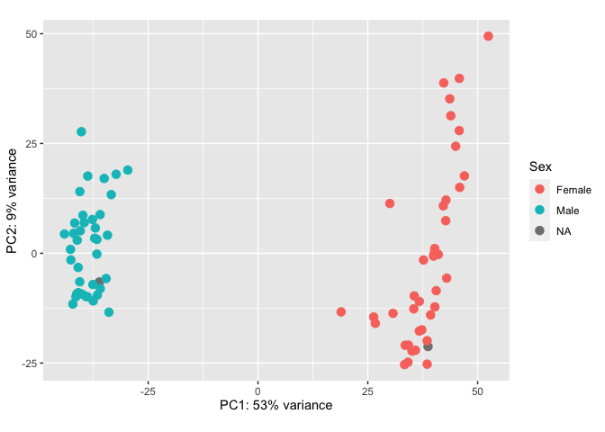
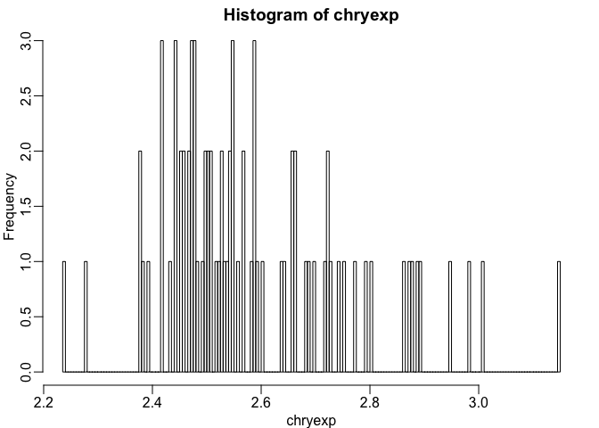
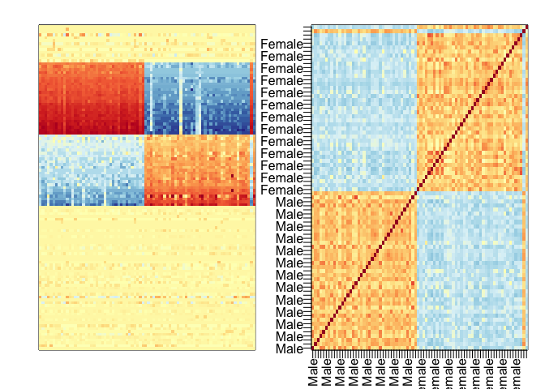
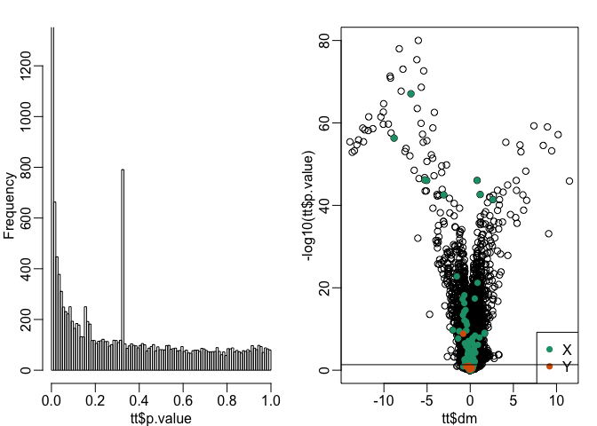
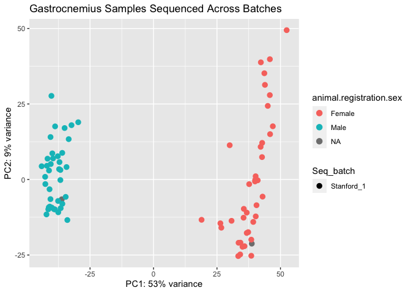

PASS1A Rat Liver (Stanford Batch 1) RNA-Seq: Circadian vs. Exercise:
What Drives Variance?
================
Alec Steep and Jiayu Zhang
20200331

## Goals of Analysis

  - TODO: Continue Step-by-step goals of analysis
  - Perform a PCA of Liver
      - If Liver clusters by sex, investigate clustering by autosomal
        and sex genes
          - Histogram of p values by autosomal genes and sex genes (BOTH
            X and Y chromosomes\!)
          - Match with volcano plots
      - Either correct for sex batch, remove sex genes, or subset one
        sex.
  - Perform another PCA with exercise groups, do they cluster together
    by:
      - Time of day?
      - Exercise cohort?
      - Other metadata? – EDA (dunno yet)
  - Build a correlation matrix – EDA (dunno yet)
  - Subset genes into 2 groups:
      - Genes associated with circadian rhythm in Rat Liver (We don’t
        have this set, we use Mouse Liver)
      - Genes associated with exercise effects (TODO: Gene sets need to
        be collected).
  - Investiagte batch
      - Examine overlap of 2 gene sets
      - Rank genes by p-value (dunno how to do this yet, unless by
        differential expression)
          - TODO: Determien ranking strategy
      - Statistical test involving rank – dunno: wilcoxen rank sum test?
          - TODO: Determine proper test
      - Cluster: PCAs – EDA
  - To be continued
…

## Setup the Environment

``` r
################################################################################
##### Resources and Dependencies ###############################################
################################################################################

# Set the working directory
WD <- '/Volumes/Frishman_4TB/motrpac/20200309_rna-seq_steep'
#setwd(WD)

# Load the dependencies
#source("https://bioconductor.org/biocLite.R")
#BiocManager::install("qvalue")
#install.packages("tidyverse")

# Load dependencies
pacs...man <- c("tidyverse","GenomicRanges", "DESeq2","devtools","rafalib","GO.db","vsn","hexbin","ggplot2", "GenomicFeatures","Biostrings","BSgenome","AnnotationHub","plyr","dplyr", "org.Rn.eg.db","pheatmap","sva","formula.tools","pathview","biomaRt", "PROPER","SeqGSEA",'purrr','BioInstaller','RColorBrewer','lubridate', "hms","ggpubr", "ggrepel","genefilter","qvalue")
lapply(pacs...man, FUN = function(X) {
        do.call("library", list(X)) })
```

    ## [[1]]
    ##  [1] "forcats"   "stringr"   "dplyr"     "purrr"     "readr"     "tidyr"    
    ##  [7] "tibble"    "ggplot2"   "tidyverse" "stats"     "graphics"  "grDevices"
    ## [13] "utils"     "datasets"  "methods"   "base"     
    ## 
    ## [[2]]
    ##  [1] "GenomicRanges" "GenomeInfoDb"  "IRanges"       "S4Vectors"    
    ##  [5] "BiocGenerics"  "parallel"      "stats4"        "forcats"      
    ##  [9] "stringr"       "dplyr"         "purrr"         "readr"        
    ## [13] "tidyr"         "tibble"        "ggplot2"       "tidyverse"    
    ## [17] "stats"         "graphics"      "grDevices"     "utils"        
    ## [21] "datasets"      "methods"       "base"         
    ## 
    ## [[3]]
    ##  [1] "DESeq2"               "SummarizedExperiment" "DelayedArray"        
    ##  [4] "BiocParallel"         "matrixStats"          "Biobase"             
    ##  [7] "GenomicRanges"        "GenomeInfoDb"         "IRanges"             
    ## [10] "S4Vectors"            "BiocGenerics"         "parallel"            
    ## [13] "stats4"               "forcats"              "stringr"             
    ## [16] "dplyr"                "purrr"                "readr"               
    ## [19] "tidyr"                "tibble"               "ggplot2"             
    ## [22] "tidyverse"            "stats"                "graphics"            
    ## [25] "grDevices"            "utils"                "datasets"            
    ## [28] "methods"              "base"                
    ## 
    ## [[4]]
    ##  [1] "devtools"             "usethis"              "DESeq2"              
    ##  [4] "SummarizedExperiment" "DelayedArray"         "BiocParallel"        
    ##  [7] "matrixStats"          "Biobase"              "GenomicRanges"       
    ## [10] "GenomeInfoDb"         "IRanges"              "S4Vectors"           
    ## [13] "BiocGenerics"         "parallel"             "stats4"              
    ## [16] "forcats"              "stringr"              "dplyr"               
    ## [19] "purrr"                "readr"                "tidyr"               
    ## [22] "tibble"               "ggplot2"              "tidyverse"           
    ## [25] "stats"                "graphics"             "grDevices"           
    ## [28] "utils"                "datasets"             "methods"             
    ## [31] "base"                
    ## 
    ## [[5]]
    ##  [1] "rafalib"              "devtools"             "usethis"             
    ##  [4] "DESeq2"               "SummarizedExperiment" "DelayedArray"        
    ##  [7] "BiocParallel"         "matrixStats"          "Biobase"             
    ## [10] "GenomicRanges"        "GenomeInfoDb"         "IRanges"             
    ## [13] "S4Vectors"            "BiocGenerics"         "parallel"            
    ## [16] "stats4"               "forcats"              "stringr"             
    ## [19] "dplyr"                "purrr"                "readr"               
    ## [22] "tidyr"                "tibble"               "ggplot2"             
    ## [25] "tidyverse"            "stats"                "graphics"            
    ## [28] "grDevices"            "utils"                "datasets"            
    ## [31] "methods"              "base"                
    ## 
    ## [[6]]
    ##  [1] "GO.db"                "AnnotationDbi"        "rafalib"             
    ##  [4] "devtools"             "usethis"              "DESeq2"              
    ##  [7] "SummarizedExperiment" "DelayedArray"         "BiocParallel"        
    ## [10] "matrixStats"          "Biobase"              "GenomicRanges"       
    ## [13] "GenomeInfoDb"         "IRanges"              "S4Vectors"           
    ## [16] "BiocGenerics"         "parallel"             "stats4"              
    ## [19] "forcats"              "stringr"              "dplyr"               
    ## [22] "purrr"                "readr"                "tidyr"               
    ## [25] "tibble"               "ggplot2"              "tidyverse"           
    ## [28] "stats"                "graphics"             "grDevices"           
    ## [31] "utils"                "datasets"             "methods"             
    ## [34] "base"                
    ## 
    ## [[7]]
    ##  [1] "vsn"                  "GO.db"                "AnnotationDbi"       
    ##  [4] "rafalib"              "devtools"             "usethis"             
    ##  [7] "DESeq2"               "SummarizedExperiment" "DelayedArray"        
    ## [10] "BiocParallel"         "matrixStats"          "Biobase"             
    ## [13] "GenomicRanges"        "GenomeInfoDb"         "IRanges"             
    ## [16] "S4Vectors"            "BiocGenerics"         "parallel"            
    ## [19] "stats4"               "forcats"              "stringr"             
    ## [22] "dplyr"                "purrr"                "readr"               
    ## [25] "tidyr"                "tibble"               "ggplot2"             
    ## [28] "tidyverse"            "stats"                "graphics"            
    ## [31] "grDevices"            "utils"                "datasets"            
    ## [34] "methods"              "base"                
    ## 
    ## [[8]]
    ##  [1] "hexbin"               "vsn"                  "GO.db"               
    ##  [4] "AnnotationDbi"        "rafalib"              "devtools"            
    ##  [7] "usethis"              "DESeq2"               "SummarizedExperiment"
    ## [10] "DelayedArray"         "BiocParallel"         "matrixStats"         
    ## [13] "Biobase"              "GenomicRanges"        "GenomeInfoDb"        
    ## [16] "IRanges"              "S4Vectors"            "BiocGenerics"        
    ## [19] "parallel"             "stats4"               "forcats"             
    ## [22] "stringr"              "dplyr"                "purrr"               
    ## [25] "readr"                "tidyr"                "tibble"              
    ## [28] "ggplot2"              "tidyverse"            "stats"               
    ## [31] "graphics"             "grDevices"            "utils"               
    ## [34] "datasets"             "methods"              "base"                
    ## 
    ## [[9]]
    ##  [1] "hexbin"               "vsn"                  "GO.db"               
    ##  [4] "AnnotationDbi"        "rafalib"              "devtools"            
    ##  [7] "usethis"              "DESeq2"               "SummarizedExperiment"
    ## [10] "DelayedArray"         "BiocParallel"         "matrixStats"         
    ## [13] "Biobase"              "GenomicRanges"        "GenomeInfoDb"        
    ## [16] "IRanges"              "S4Vectors"            "BiocGenerics"        
    ## [19] "parallel"             "stats4"               "forcats"             
    ## [22] "stringr"              "dplyr"                "purrr"               
    ## [25] "readr"                "tidyr"                "tibble"              
    ## [28] "ggplot2"              "tidyverse"            "stats"               
    ## [31] "graphics"             "grDevices"            "utils"               
    ## [34] "datasets"             "methods"              "base"                
    ## 
    ## [[10]]
    ##  [1] "GenomicFeatures"      "hexbin"               "vsn"                 
    ##  [4] "GO.db"                "AnnotationDbi"        "rafalib"             
    ##  [7] "devtools"             "usethis"              "DESeq2"              
    ## [10] "SummarizedExperiment" "DelayedArray"         "BiocParallel"        
    ## [13] "matrixStats"          "Biobase"              "GenomicRanges"       
    ## [16] "GenomeInfoDb"         "IRanges"              "S4Vectors"           
    ## [19] "BiocGenerics"         "parallel"             "stats4"              
    ## [22] "forcats"              "stringr"              "dplyr"               
    ## [25] "purrr"                "readr"                "tidyr"               
    ## [28] "tibble"               "ggplot2"              "tidyverse"           
    ## [31] "stats"                "graphics"             "grDevices"           
    ## [34] "utils"                "datasets"             "methods"             
    ## [37] "base"                
    ## 
    ## [[11]]
    ##  [1] "Biostrings"           "XVector"              "GenomicFeatures"     
    ##  [4] "hexbin"               "vsn"                  "GO.db"               
    ##  [7] "AnnotationDbi"        "rafalib"              "devtools"            
    ## [10] "usethis"              "DESeq2"               "SummarizedExperiment"
    ## [13] "DelayedArray"         "BiocParallel"         "matrixStats"         
    ## [16] "Biobase"              "GenomicRanges"        "GenomeInfoDb"        
    ## [19] "IRanges"              "S4Vectors"            "BiocGenerics"        
    ## [22] "parallel"             "stats4"               "forcats"             
    ## [25] "stringr"              "dplyr"                "purrr"               
    ## [28] "readr"                "tidyr"                "tibble"              
    ## [31] "ggplot2"              "tidyverse"            "stats"               
    ## [34] "graphics"             "grDevices"            "utils"               
    ## [37] "datasets"             "methods"              "base"                
    ## 
    ## [[12]]
    ##  [1] "BSgenome"             "rtracklayer"          "Biostrings"          
    ##  [4] "XVector"              "GenomicFeatures"      "hexbin"              
    ##  [7] "vsn"                  "GO.db"                "AnnotationDbi"       
    ## [10] "rafalib"              "devtools"             "usethis"             
    ## [13] "DESeq2"               "SummarizedExperiment" "DelayedArray"        
    ## [16] "BiocParallel"         "matrixStats"          "Biobase"             
    ## [19] "GenomicRanges"        "GenomeInfoDb"         "IRanges"             
    ## [22] "S4Vectors"            "BiocGenerics"         "parallel"            
    ## [25] "stats4"               "forcats"              "stringr"             
    ## [28] "dplyr"                "purrr"                "readr"               
    ## [31] "tidyr"                "tibble"               "ggplot2"             
    ## [34] "tidyverse"            "stats"                "graphics"            
    ## [37] "grDevices"            "utils"                "datasets"            
    ## [40] "methods"              "base"                
    ## 
    ## [[13]]
    ##  [1] "AnnotationHub"        "BiocFileCache"        "dbplyr"              
    ##  [4] "BSgenome"             "rtracklayer"          "Biostrings"          
    ##  [7] "XVector"              "GenomicFeatures"      "hexbin"              
    ## [10] "vsn"                  "GO.db"                "AnnotationDbi"       
    ## [13] "rafalib"              "devtools"             "usethis"             
    ## [16] "DESeq2"               "SummarizedExperiment" "DelayedArray"        
    ## [19] "BiocParallel"         "matrixStats"          "Biobase"             
    ## [22] "GenomicRanges"        "GenomeInfoDb"         "IRanges"             
    ## [25] "S4Vectors"            "BiocGenerics"         "parallel"            
    ## [28] "stats4"               "forcats"              "stringr"             
    ## [31] "dplyr"                "purrr"                "readr"               
    ## [34] "tidyr"                "tibble"               "ggplot2"             
    ## [37] "tidyverse"            "stats"                "graphics"            
    ## [40] "grDevices"            "utils"                "datasets"            
    ## [43] "methods"              "base"                
    ## 
    ## [[14]]
    ##  [1] "plyr"                 "AnnotationHub"        "BiocFileCache"       
    ##  [4] "dbplyr"               "BSgenome"             "rtracklayer"         
    ##  [7] "Biostrings"           "XVector"              "GenomicFeatures"     
    ## [10] "hexbin"               "vsn"                  "GO.db"               
    ## [13] "AnnotationDbi"        "rafalib"              "devtools"            
    ## [16] "usethis"              "DESeq2"               "SummarizedExperiment"
    ## [19] "DelayedArray"         "BiocParallel"         "matrixStats"         
    ## [22] "Biobase"              "GenomicRanges"        "GenomeInfoDb"        
    ## [25] "IRanges"              "S4Vectors"            "BiocGenerics"        
    ## [28] "parallel"             "stats4"               "forcats"             
    ## [31] "stringr"              "dplyr"                "purrr"               
    ## [34] "readr"                "tidyr"                "tibble"              
    ## [37] "ggplot2"              "tidyverse"            "stats"               
    ## [40] "graphics"             "grDevices"            "utils"               
    ## [43] "datasets"             "methods"              "base"                
    ## 
    ## [[15]]
    ##  [1] "plyr"                 "AnnotationHub"        "BiocFileCache"       
    ##  [4] "dbplyr"               "BSgenome"             "rtracklayer"         
    ##  [7] "Biostrings"           "XVector"              "GenomicFeatures"     
    ## [10] "hexbin"               "vsn"                  "GO.db"               
    ## [13] "AnnotationDbi"        "rafalib"              "devtools"            
    ## [16] "usethis"              "DESeq2"               "SummarizedExperiment"
    ## [19] "DelayedArray"         "BiocParallel"         "matrixStats"         
    ## [22] "Biobase"              "GenomicRanges"        "GenomeInfoDb"        
    ## [25] "IRanges"              "S4Vectors"            "BiocGenerics"        
    ## [28] "parallel"             "stats4"               "forcats"             
    ## [31] "stringr"              "dplyr"                "purrr"               
    ## [34] "readr"                "tidyr"                "tibble"              
    ## [37] "ggplot2"              "tidyverse"            "stats"               
    ## [40] "graphics"             "grDevices"            "utils"               
    ## [43] "datasets"             "methods"              "base"                
    ## 
    ## [[16]]
    ##  [1] "org.Rn.eg.db"         "plyr"                 "AnnotationHub"       
    ##  [4] "BiocFileCache"        "dbplyr"               "BSgenome"            
    ##  [7] "rtracklayer"          "Biostrings"           "XVector"             
    ## [10] "GenomicFeatures"      "hexbin"               "vsn"                 
    ## [13] "GO.db"                "AnnotationDbi"        "rafalib"             
    ## [16] "devtools"             "usethis"              "DESeq2"              
    ## [19] "SummarizedExperiment" "DelayedArray"         "BiocParallel"        
    ## [22] "matrixStats"          "Biobase"              "GenomicRanges"       
    ## [25] "GenomeInfoDb"         "IRanges"              "S4Vectors"           
    ## [28] "BiocGenerics"         "parallel"             "stats4"              
    ## [31] "forcats"              "stringr"              "dplyr"               
    ## [34] "purrr"                "readr"                "tidyr"               
    ## [37] "tibble"               "ggplot2"              "tidyverse"           
    ## [40] "stats"                "graphics"             "grDevices"           
    ## [43] "utils"                "datasets"             "methods"             
    ## [46] "base"                
    ## 
    ## [[17]]
    ##  [1] "pheatmap"             "org.Rn.eg.db"         "plyr"                
    ##  [4] "AnnotationHub"        "BiocFileCache"        "dbplyr"              
    ##  [7] "BSgenome"             "rtracklayer"          "Biostrings"          
    ## [10] "XVector"              "GenomicFeatures"      "hexbin"              
    ## [13] "vsn"                  "GO.db"                "AnnotationDbi"       
    ## [16] "rafalib"              "devtools"             "usethis"             
    ## [19] "DESeq2"               "SummarizedExperiment" "DelayedArray"        
    ## [22] "BiocParallel"         "matrixStats"          "Biobase"             
    ## [25] "GenomicRanges"        "GenomeInfoDb"         "IRanges"             
    ## [28] "S4Vectors"            "BiocGenerics"         "parallel"            
    ## [31] "stats4"               "forcats"              "stringr"             
    ## [34] "dplyr"                "purrr"                "readr"               
    ## [37] "tidyr"                "tibble"               "ggplot2"             
    ## [40] "tidyverse"            "stats"                "graphics"            
    ## [43] "grDevices"            "utils"                "datasets"            
    ## [46] "methods"              "base"                
    ## 
    ## [[18]]
    ##  [1] "sva"                  "genefilter"           "mgcv"                
    ##  [4] "nlme"                 "pheatmap"             "org.Rn.eg.db"        
    ##  [7] "plyr"                 "AnnotationHub"        "BiocFileCache"       
    ## [10] "dbplyr"               "BSgenome"             "rtracklayer"         
    ## [13] "Biostrings"           "XVector"              "GenomicFeatures"     
    ## [16] "hexbin"               "vsn"                  "GO.db"               
    ## [19] "AnnotationDbi"        "rafalib"              "devtools"            
    ## [22] "usethis"              "DESeq2"               "SummarizedExperiment"
    ## [25] "DelayedArray"         "BiocParallel"         "matrixStats"         
    ## [28] "Biobase"              "GenomicRanges"        "GenomeInfoDb"        
    ## [31] "IRanges"              "S4Vectors"            "BiocGenerics"        
    ## [34] "parallel"             "stats4"               "forcats"             
    ## [37] "stringr"              "dplyr"                "purrr"               
    ## [40] "readr"                "tidyr"                "tibble"              
    ## [43] "ggplot2"              "tidyverse"            "stats"               
    ## [46] "graphics"             "grDevices"            "utils"               
    ## [49] "datasets"             "methods"              "base"                
    ## 
    ## [[19]]
    ##  [1] "formula.tools"        "sva"                  "genefilter"          
    ##  [4] "mgcv"                 "nlme"                 "pheatmap"            
    ##  [7] "org.Rn.eg.db"         "plyr"                 "AnnotationHub"       
    ## [10] "BiocFileCache"        "dbplyr"               "BSgenome"            
    ## [13] "rtracklayer"          "Biostrings"           "XVector"             
    ## [16] "GenomicFeatures"      "hexbin"               "vsn"                 
    ## [19] "GO.db"                "AnnotationDbi"        "rafalib"             
    ## [22] "devtools"             "usethis"              "DESeq2"              
    ## [25] "SummarizedExperiment" "DelayedArray"         "BiocParallel"        
    ## [28] "matrixStats"          "Biobase"              "GenomicRanges"       
    ## [31] "GenomeInfoDb"         "IRanges"              "S4Vectors"           
    ## [34] "BiocGenerics"         "parallel"             "stats4"              
    ## [37] "forcats"              "stringr"              "dplyr"               
    ## [40] "purrr"                "readr"                "tidyr"               
    ## [43] "tibble"               "ggplot2"              "tidyverse"           
    ## [46] "stats"                "graphics"             "grDevices"           
    ## [49] "utils"                "datasets"             "methods"             
    ## [52] "base"                
    ## 
    ## [[20]]
    ##  [1] "pathview"             "org.Hs.eg.db"         "formula.tools"       
    ##  [4] "sva"                  "genefilter"           "mgcv"                
    ##  [7] "nlme"                 "pheatmap"             "org.Rn.eg.db"        
    ## [10] "plyr"                 "AnnotationHub"        "BiocFileCache"       
    ## [13] "dbplyr"               "BSgenome"             "rtracklayer"         
    ## [16] "Biostrings"           "XVector"              "GenomicFeatures"     
    ## [19] "hexbin"               "vsn"                  "GO.db"               
    ## [22] "AnnotationDbi"        "rafalib"              "devtools"            
    ## [25] "usethis"              "DESeq2"               "SummarizedExperiment"
    ## [28] "DelayedArray"         "BiocParallel"         "matrixStats"         
    ## [31] "Biobase"              "GenomicRanges"        "GenomeInfoDb"        
    ## [34] "IRanges"              "S4Vectors"            "BiocGenerics"        
    ## [37] "parallel"             "stats4"               "forcats"             
    ## [40] "stringr"              "dplyr"                "purrr"               
    ## [43] "readr"                "tidyr"                "tibble"              
    ## [46] "ggplot2"              "tidyverse"            "stats"               
    ## [49] "graphics"             "grDevices"            "utils"               
    ## [52] "datasets"             "methods"              "base"                
    ## 
    ## [[21]]
    ##  [1] "biomaRt"              "pathview"             "org.Hs.eg.db"        
    ##  [4] "formula.tools"        "sva"                  "genefilter"          
    ##  [7] "mgcv"                 "nlme"                 "pheatmap"            
    ## [10] "org.Rn.eg.db"         "plyr"                 "AnnotationHub"       
    ## [13] "BiocFileCache"        "dbplyr"               "BSgenome"            
    ## [16] "rtracklayer"          "Biostrings"           "XVector"             
    ## [19] "GenomicFeatures"      "hexbin"               "vsn"                 
    ## [22] "GO.db"                "AnnotationDbi"        "rafalib"             
    ## [25] "devtools"             "usethis"              "DESeq2"              
    ## [28] "SummarizedExperiment" "DelayedArray"         "BiocParallel"        
    ## [31] "matrixStats"          "Biobase"              "GenomicRanges"       
    ## [34] "GenomeInfoDb"         "IRanges"              "S4Vectors"           
    ## [37] "BiocGenerics"         "parallel"             "stats4"              
    ## [40] "forcats"              "stringr"              "dplyr"               
    ## [43] "purrr"                "readr"                "tidyr"               
    ## [46] "tibble"               "ggplot2"              "tidyverse"           
    ## [49] "stats"                "graphics"             "grDevices"           
    ## [52] "utils"                "datasets"             "methods"             
    ## [55] "base"                
    ## 
    ## [[22]]
    ##  [1] "PROPER"               "biomaRt"              "pathview"            
    ##  [4] "org.Hs.eg.db"         "formula.tools"        "sva"                 
    ##  [7] "genefilter"           "mgcv"                 "nlme"                
    ## [10] "pheatmap"             "org.Rn.eg.db"         "plyr"                
    ## [13] "AnnotationHub"        "BiocFileCache"        "dbplyr"              
    ## [16] "BSgenome"             "rtracklayer"          "Biostrings"          
    ## [19] "XVector"              "GenomicFeatures"      "hexbin"              
    ## [22] "vsn"                  "GO.db"                "AnnotationDbi"       
    ## [25] "rafalib"              "devtools"             "usethis"             
    ## [28] "DESeq2"               "SummarizedExperiment" "DelayedArray"        
    ## [31] "BiocParallel"         "matrixStats"          "Biobase"             
    ## [34] "GenomicRanges"        "GenomeInfoDb"         "IRanges"             
    ## [37] "S4Vectors"            "BiocGenerics"         "parallel"            
    ## [40] "stats4"               "forcats"              "stringr"             
    ## [43] "dplyr"                "purrr"                "readr"               
    ## [46] "tidyr"                "tibble"               "ggplot2"             
    ## [49] "tidyverse"            "stats"                "graphics"            
    ## [52] "grDevices"            "utils"                "datasets"            
    ## [55] "methods"              "base"                
    ## 
    ## [[23]]
    ##  [1] "SeqGSEA"              "DESeq"                "lattice"             
    ##  [4] "locfit"               "doParallel"           "iterators"           
    ##  [7] "foreach"              "PROPER"               "biomaRt"             
    ## [10] "pathview"             "org.Hs.eg.db"         "formula.tools"       
    ## [13] "sva"                  "genefilter"           "mgcv"                
    ## [16] "nlme"                 "pheatmap"             "org.Rn.eg.db"        
    ## [19] "plyr"                 "AnnotationHub"        "BiocFileCache"       
    ## [22] "dbplyr"               "BSgenome"             "rtracklayer"         
    ## [25] "Biostrings"           "XVector"              "GenomicFeatures"     
    ## [28] "hexbin"               "vsn"                  "GO.db"               
    ## [31] "AnnotationDbi"        "rafalib"              "devtools"            
    ## [34] "usethis"              "DESeq2"               "SummarizedExperiment"
    ## [37] "DelayedArray"         "BiocParallel"         "matrixStats"         
    ## [40] "Biobase"              "GenomicRanges"        "GenomeInfoDb"        
    ## [43] "IRanges"              "S4Vectors"            "BiocGenerics"        
    ## [46] "parallel"             "stats4"               "forcats"             
    ## [49] "stringr"              "dplyr"                "purrr"               
    ## [52] "readr"                "tidyr"                "tibble"              
    ## [55] "ggplot2"              "tidyverse"            "stats"               
    ## [58] "graphics"             "grDevices"            "utils"               
    ## [61] "datasets"             "methods"              "base"                
    ## 
    ## [[24]]
    ##  [1] "SeqGSEA"              "DESeq"                "lattice"             
    ##  [4] "locfit"               "doParallel"           "iterators"           
    ##  [7] "foreach"              "PROPER"               "biomaRt"             
    ## [10] "pathview"             "org.Hs.eg.db"         "formula.tools"       
    ## [13] "sva"                  "genefilter"           "mgcv"                
    ## [16] "nlme"                 "pheatmap"             "org.Rn.eg.db"        
    ## [19] "plyr"                 "AnnotationHub"        "BiocFileCache"       
    ## [22] "dbplyr"               "BSgenome"             "rtracklayer"         
    ## [25] "Biostrings"           "XVector"              "GenomicFeatures"     
    ## [28] "hexbin"               "vsn"                  "GO.db"               
    ## [31] "AnnotationDbi"        "rafalib"              "devtools"            
    ## [34] "usethis"              "DESeq2"               "SummarizedExperiment"
    ## [37] "DelayedArray"         "BiocParallel"         "matrixStats"         
    ## [40] "Biobase"              "GenomicRanges"        "GenomeInfoDb"        
    ## [43] "IRanges"              "S4Vectors"            "BiocGenerics"        
    ## [46] "parallel"             "stats4"               "forcats"             
    ## [49] "stringr"              "dplyr"                "purrr"               
    ## [52] "readr"                "tidyr"                "tibble"              
    ## [55] "ggplot2"              "tidyverse"            "stats"               
    ## [58] "graphics"             "grDevices"            "utils"               
    ## [61] "datasets"             "methods"              "base"                
    ## 
    ## [[25]]
    ##  [1] "BioInstaller"         "SeqGSEA"              "DESeq"               
    ##  [4] "lattice"              "locfit"               "doParallel"          
    ##  [7] "iterators"            "foreach"              "PROPER"              
    ## [10] "biomaRt"              "pathview"             "org.Hs.eg.db"        
    ## [13] "formula.tools"        "sva"                  "genefilter"          
    ## [16] "mgcv"                 "nlme"                 "pheatmap"            
    ## [19] "org.Rn.eg.db"         "plyr"                 "AnnotationHub"       
    ## [22] "BiocFileCache"        "dbplyr"               "BSgenome"            
    ## [25] "rtracklayer"          "Biostrings"           "XVector"             
    ## [28] "GenomicFeatures"      "hexbin"               "vsn"                 
    ## [31] "GO.db"                "AnnotationDbi"        "rafalib"             
    ## [34] "devtools"             "usethis"              "DESeq2"              
    ## [37] "SummarizedExperiment" "DelayedArray"         "BiocParallel"        
    ## [40] "matrixStats"          "Biobase"              "GenomicRanges"       
    ## [43] "GenomeInfoDb"         "IRanges"              "S4Vectors"           
    ## [46] "BiocGenerics"         "parallel"             "stats4"              
    ## [49] "forcats"              "stringr"              "dplyr"               
    ## [52] "purrr"                "readr"                "tidyr"               
    ## [55] "tibble"               "ggplot2"              "tidyverse"           
    ## [58] "stats"                "graphics"             "grDevices"           
    ## [61] "utils"                "datasets"             "methods"             
    ## [64] "base"                
    ## 
    ## [[26]]
    ##  [1] "RColorBrewer"         "BioInstaller"         "SeqGSEA"             
    ##  [4] "DESeq"                "lattice"              "locfit"              
    ##  [7] "doParallel"           "iterators"            "foreach"             
    ## [10] "PROPER"               "biomaRt"              "pathview"            
    ## [13] "org.Hs.eg.db"         "formula.tools"        "sva"                 
    ## [16] "genefilter"           "mgcv"                 "nlme"                
    ## [19] "pheatmap"             "org.Rn.eg.db"         "plyr"                
    ## [22] "AnnotationHub"        "BiocFileCache"        "dbplyr"              
    ## [25] "BSgenome"             "rtracklayer"          "Biostrings"          
    ## [28] "XVector"              "GenomicFeatures"      "hexbin"              
    ## [31] "vsn"                  "GO.db"                "AnnotationDbi"       
    ## [34] "rafalib"              "devtools"             "usethis"             
    ## [37] "DESeq2"               "SummarizedExperiment" "DelayedArray"        
    ## [40] "BiocParallel"         "matrixStats"          "Biobase"             
    ## [43] "GenomicRanges"        "GenomeInfoDb"         "IRanges"             
    ## [46] "S4Vectors"            "BiocGenerics"         "parallel"            
    ## [49] "stats4"               "forcats"              "stringr"             
    ## [52] "dplyr"                "purrr"                "readr"               
    ## [55] "tidyr"                "tibble"               "ggplot2"             
    ## [58] "tidyverse"            "stats"                "graphics"            
    ## [61] "grDevices"            "utils"                "datasets"            
    ## [64] "methods"              "base"                
    ## 
    ## [[27]]
    ##  [1] "lubridate"            "RColorBrewer"         "BioInstaller"        
    ##  [4] "SeqGSEA"              "DESeq"                "lattice"             
    ##  [7] "locfit"               "doParallel"           "iterators"           
    ## [10] "foreach"              "PROPER"               "biomaRt"             
    ## [13] "pathview"             "org.Hs.eg.db"         "formula.tools"       
    ## [16] "sva"                  "genefilter"           "mgcv"                
    ## [19] "nlme"                 "pheatmap"             "org.Rn.eg.db"        
    ## [22] "plyr"                 "AnnotationHub"        "BiocFileCache"       
    ## [25] "dbplyr"               "BSgenome"             "rtracklayer"         
    ## [28] "Biostrings"           "XVector"              "GenomicFeatures"     
    ## [31] "hexbin"               "vsn"                  "GO.db"               
    ## [34] "AnnotationDbi"        "rafalib"              "devtools"            
    ## [37] "usethis"              "DESeq2"               "SummarizedExperiment"
    ## [40] "DelayedArray"         "BiocParallel"         "matrixStats"         
    ## [43] "Biobase"              "GenomicRanges"        "GenomeInfoDb"        
    ## [46] "IRanges"              "S4Vectors"            "BiocGenerics"        
    ## [49] "parallel"             "stats4"               "forcats"             
    ## [52] "stringr"              "dplyr"                "purrr"               
    ## [55] "readr"                "tidyr"                "tibble"              
    ## [58] "ggplot2"              "tidyverse"            "stats"               
    ## [61] "graphics"             "grDevices"            "utils"               
    ## [64] "datasets"             "methods"              "base"                
    ## 
    ## [[28]]
    ##  [1] "hms"                  "lubridate"            "RColorBrewer"        
    ##  [4] "BioInstaller"         "SeqGSEA"              "DESeq"               
    ##  [7] "lattice"              "locfit"               "doParallel"          
    ## [10] "iterators"            "foreach"              "PROPER"              
    ## [13] "biomaRt"              "pathview"             "org.Hs.eg.db"        
    ## [16] "formula.tools"        "sva"                  "genefilter"          
    ## [19] "mgcv"                 "nlme"                 "pheatmap"            
    ## [22] "org.Rn.eg.db"         "plyr"                 "AnnotationHub"       
    ## [25] "BiocFileCache"        "dbplyr"               "BSgenome"            
    ## [28] "rtracklayer"          "Biostrings"           "XVector"             
    ## [31] "GenomicFeatures"      "hexbin"               "vsn"                 
    ## [34] "GO.db"                "AnnotationDbi"        "rafalib"             
    ## [37] "devtools"             "usethis"              "DESeq2"              
    ## [40] "SummarizedExperiment" "DelayedArray"         "BiocParallel"        
    ## [43] "matrixStats"          "Biobase"              "GenomicRanges"       
    ## [46] "GenomeInfoDb"         "IRanges"              "S4Vectors"           
    ## [49] "BiocGenerics"         "parallel"             "stats4"              
    ## [52] "forcats"              "stringr"              "dplyr"               
    ## [55] "purrr"                "readr"                "tidyr"               
    ## [58] "tibble"               "ggplot2"              "tidyverse"           
    ## [61] "stats"                "graphics"             "grDevices"           
    ## [64] "utils"                "datasets"             "methods"             
    ## [67] "base"                
    ## 
    ## [[29]]
    ##  [1] "ggpubr"               "magrittr"             "hms"                 
    ##  [4] "lubridate"            "RColorBrewer"         "BioInstaller"        
    ##  [7] "SeqGSEA"              "DESeq"                "lattice"             
    ## [10] "locfit"               "doParallel"           "iterators"           
    ## [13] "foreach"              "PROPER"               "biomaRt"             
    ## [16] "pathview"             "org.Hs.eg.db"         "formula.tools"       
    ## [19] "sva"                  "genefilter"           "mgcv"                
    ## [22] "nlme"                 "pheatmap"             "org.Rn.eg.db"        
    ## [25] "plyr"                 "AnnotationHub"        "BiocFileCache"       
    ## [28] "dbplyr"               "BSgenome"             "rtracklayer"         
    ## [31] "Biostrings"           "XVector"              "GenomicFeatures"     
    ## [34] "hexbin"               "vsn"                  "GO.db"               
    ## [37] "AnnotationDbi"        "rafalib"              "devtools"            
    ## [40] "usethis"              "DESeq2"               "SummarizedExperiment"
    ## [43] "DelayedArray"         "BiocParallel"         "matrixStats"         
    ## [46] "Biobase"              "GenomicRanges"        "GenomeInfoDb"        
    ## [49] "IRanges"              "S4Vectors"            "BiocGenerics"        
    ## [52] "parallel"             "stats4"               "forcats"             
    ## [55] "stringr"              "dplyr"                "purrr"               
    ## [58] "readr"                "tidyr"                "tibble"              
    ## [61] "ggplot2"              "tidyverse"            "stats"               
    ## [64] "graphics"             "grDevices"            "utils"               
    ## [67] "datasets"             "methods"              "base"                
    ## 
    ## [[30]]
    ##  [1] "ggrepel"              "ggpubr"               "magrittr"            
    ##  [4] "hms"                  "lubridate"            "RColorBrewer"        
    ##  [7] "BioInstaller"         "SeqGSEA"              "DESeq"               
    ## [10] "lattice"              "locfit"               "doParallel"          
    ## [13] "iterators"            "foreach"              "PROPER"              
    ## [16] "biomaRt"              "pathview"             "org.Hs.eg.db"        
    ## [19] "formula.tools"        "sva"                  "genefilter"          
    ## [22] "mgcv"                 "nlme"                 "pheatmap"            
    ## [25] "org.Rn.eg.db"         "plyr"                 "AnnotationHub"       
    ## [28] "BiocFileCache"        "dbplyr"               "BSgenome"            
    ## [31] "rtracklayer"          "Biostrings"           "XVector"             
    ## [34] "GenomicFeatures"      "hexbin"               "vsn"                 
    ## [37] "GO.db"                "AnnotationDbi"        "rafalib"             
    ## [40] "devtools"             "usethis"              "DESeq2"              
    ## [43] "SummarizedExperiment" "DelayedArray"         "BiocParallel"        
    ## [46] "matrixStats"          "Biobase"              "GenomicRanges"       
    ## [49] "GenomeInfoDb"         "IRanges"              "S4Vectors"           
    ## [52] "BiocGenerics"         "parallel"             "stats4"              
    ## [55] "forcats"              "stringr"              "dplyr"               
    ## [58] "purrr"                "readr"                "tidyr"               
    ## [61] "tibble"               "ggplot2"              "tidyverse"           
    ## [64] "stats"                "graphics"             "grDevices"           
    ## [67] "utils"                "datasets"             "methods"             
    ## [70] "base"                
    ## 
    ## [[31]]
    ##  [1] "ggrepel"              "ggpubr"               "magrittr"            
    ##  [4] "hms"                  "lubridate"            "RColorBrewer"        
    ##  [7] "BioInstaller"         "SeqGSEA"              "DESeq"               
    ## [10] "lattice"              "locfit"               "doParallel"          
    ## [13] "iterators"            "foreach"              "PROPER"              
    ## [16] "biomaRt"              "pathview"             "org.Hs.eg.db"        
    ## [19] "formula.tools"        "sva"                  "genefilter"          
    ## [22] "mgcv"                 "nlme"                 "pheatmap"            
    ## [25] "org.Rn.eg.db"         "plyr"                 "AnnotationHub"       
    ## [28] "BiocFileCache"        "dbplyr"               "BSgenome"            
    ## [31] "rtracklayer"          "Biostrings"           "XVector"             
    ## [34] "GenomicFeatures"      "hexbin"               "vsn"                 
    ## [37] "GO.db"                "AnnotationDbi"        "rafalib"             
    ## [40] "devtools"             "usethis"              "DESeq2"              
    ## [43] "SummarizedExperiment" "DelayedArray"         "BiocParallel"        
    ## [46] "matrixStats"          "Biobase"              "GenomicRanges"       
    ## [49] "GenomeInfoDb"         "IRanges"              "S4Vectors"           
    ## [52] "BiocGenerics"         "parallel"             "stats4"              
    ## [55] "forcats"              "stringr"              "dplyr"               
    ## [58] "purrr"                "readr"                "tidyr"               
    ## [61] "tibble"               "ggplot2"              "tidyverse"           
    ## [64] "stats"                "graphics"             "grDevices"           
    ## [67] "utils"                "datasets"             "methods"             
    ## [70] "base"                
    ## 
    ## [[32]]
    ##  [1] "qvalue"               "ggrepel"              "ggpubr"              
    ##  [4] "magrittr"             "hms"                  "lubridate"           
    ##  [7] "RColorBrewer"         "BioInstaller"         "SeqGSEA"             
    ## [10] "DESeq"                "lattice"              "locfit"              
    ## [13] "doParallel"           "iterators"            "foreach"             
    ## [16] "PROPER"               "biomaRt"              "pathview"            
    ## [19] "org.Hs.eg.db"         "formula.tools"        "sva"                 
    ## [22] "genefilter"           "mgcv"                 "nlme"                
    ## [25] "pheatmap"             "org.Rn.eg.db"         "plyr"                
    ## [28] "AnnotationHub"        "BiocFileCache"        "dbplyr"              
    ## [31] "BSgenome"             "rtracklayer"          "Biostrings"          
    ## [34] "XVector"              "GenomicFeatures"      "hexbin"              
    ## [37] "vsn"                  "GO.db"                "AnnotationDbi"       
    ## [40] "rafalib"              "devtools"             "usethis"             
    ## [43] "DESeq2"               "SummarizedExperiment" "DelayedArray"        
    ## [46] "BiocParallel"         "matrixStats"          "Biobase"             
    ## [49] "GenomicRanges"        "GenomeInfoDb"         "IRanges"             
    ## [52] "S4Vectors"            "BiocGenerics"         "parallel"            
    ## [55] "stats4"               "forcats"              "stringr"             
    ## [58] "dplyr"                "purrr"                "readr"               
    ## [61] "tidyr"                "tibble"               "ggplot2"             
    ## [64] "tidyverse"            "stats"                "graphics"            
    ## [67] "grDevices"            "utils"                "datasets"            
    ## [70] "methods"              "base"

``` r
############################################################
##### Functions ############################################
############################################################

# Set select
select <- dplyr::select

# Make the 'not in' operator
################################################################################
'%!in%' <- function(x,y) {
        !('%in%'(x,y))
}
################################################################################

# Capture the Date and AUthor
################################################################################
date <- format.Date( Sys.Date(), '%Y%m%d' )
auth <- "steep"
################################################################################

## explicit gc, then execute `expr` `n` times w/o explicit gc, return timings
################################################################################
benchmark <- function(n = 1, expr, envir = parent.frame()) {
        expr <- substitute(expr)
        gc()
        map(seq_len(n), ~ system.time(eval(expr, envir), gcFirst = FALSE))
}
################################################################################

# Function to speed up making rows into lists for interation with lapply
################################################################################
f_pmap_aslist <- function(df) {
        purrr::pmap(as.list(df), list)
}
################################################################################
```

## Load & Clean Data

##### Data files to load:

  - Count Matrix and Metadata Table from:
      - RNA-Seq from Mt. Sinai
          - 3 sequencing batches & metadata
      - RNA-Seq from Stanford
          - 2 sequencing batches &
metadata

<!-- end list -->

``` r
################################################################################
#####     Load & Clean Data      ###############################################
################################################################################

# Files last saved in: 20200309_exploration-rna-seq-phase1_steep.R

# Count matrix
in_file <- paste0(WD,'/data/20200326_rnaseq-countmatrix-pass1a-stanford-sinai_steep.csv')
count_data <- read.table(in_file,sep = ',', header = TRUE,row.names = 1,check.names = FALSE)

# Meatdata table
in_file <- paste0(WD,'/data/20200326_rnaseq-meta-pass1a-stanford-sinai_steep.txt')
col_data <- read.table(in_file, header = TRUE, check.names = FALSE, sep = '\t')
row.names(col_data) <- col_data$sample_key
```

## Place Genes in Genomic Ranges

#### Reference Genome and Annotation: Rnor\_6.0 (GCA\_000001895.4) assembly from Ensembl database (Release 96)

Found at: <http://uswest.ensembl.org/Rattus_norvegicus/Info/Index>.

FASTA: Rattus\_norvegicus.Rnor\_6.0.dna.toplevel.fa.gz
<ftp://ftp.ensembl.org/pub/release-96/fasta/rattus_norvegicus/dna/Rattus_norvegicus.Rnor_6.0.dna.toplevel.fa.gz>

GTF: Rattus\_norvegicus.Rnor\_6.0.96.gtf.gz
<ftp://ftp.ensembl.org/pub/release-96/gtf/rattus_norvegicus/Rattus_norvegicus.Rnor_6.0.96.gtf.gz>

``` r
################################################################################
#####     Annotate Genes by Chromosome       ###################################
################################################################################

# TODO: Load Reference genome and annotations

### Determine which control samples are male and female
# Get the list of genes on the W chromosome

# Construct your own personal galgal5 reference genome annotation
# Construct from gtf file from Ensembl (same file used in mapping)
ens_gtf <- paste0(WD,'/data/Rattus_norvegicus.Rnor_6.0.96.gtf')
Rn_TxDb <- makeTxDbFromGFF(ens_gtf,
                           format=c("gtf"),
                           dataSource="Ensembl_Rattus6_gtf",
                           organism="Rattus norvegicus",
                           taxonomyId=NA,
                           circ_seqs=DEFAULT_CIRC_SEQS,
                           chrominfo=NULL,
                           miRBaseBuild=NA,
                           metadata=NULL)

# Define Female specific sex genes (X chromosome)
# To examine chromosome names
seqlevels(Rn_TxDb)[1:35]
```

    ##  [1] "1"              "2"              "3"              "4"             
    ##  [5] "5"              "6"              "7"              "8"             
    ##  [9] "9"              "10"             "11"             "12"            
    ## [13] "13"             "14"             "15"             "16"            
    ## [17] "17"             "18"             "19"             "20"            
    ## [21] "X"              "Y"              "MT"             "AABR07022258.1"
    ## [25] "AABR07022620.1" "AABR07022926.1" "AABR07024031.1" "AABR07024032.1"
    ## [29] "AABR07024040.1" "AABR07024041.1" "AABR07024044.1" "AABR07024102.1"
    ## [33] "AABR07024104.1" "AABR07024106.1" "AABR07024115.1"

``` r
# Extract genes as GRanges object, then names
X_genes_gr <- genes(Rn_TxDb, columns = "TXCHROM", filter = list(tx_chrom=c("X")))
# Collect ensembl gene ids for female specific genes
X_ens_id <- names(X_genes_gr)
# Examine the gene symbols
X_sym <- mapIds(org.Rn.eg.db, names(X_genes_gr), "SYMBOL", "ENSEMBL")
# Extract genes as GRanges object, then names
Y_genes_gr <- genes(Rn_TxDb, columns = "TXCHROM", filter = list(tx_chrom=c("Y")))
# Collect ensembl gene ids for female specific genes
Y_ens_id <- names(Y_genes_gr)
sex_ens_id <- c(X_ens_id,Y_ens_id)
# Examine the gene symbols
Y_sym <- mapIds(org.Rn.eg.db, names(Y_genes_gr), "SYMBOL", "ENSEMBL")

################################################################################
```

## PCA of Liver Samples

Samples from Stanford Batch 1, which we suspect demonstrates a batch
effect

``` r
################################################################################
#####     PCA of Liver Samples       ###########################################
################################################################################

design = ~ 1 # Primary variable needs to be last
title = paste0('Design: ',as.character(design))
# Create a DESeqDataSet Object
dds <- DESeqDataSetFromMatrix(countData = count_data,
                              colData = col_data,
                              design = design)

# Perform pre-filtering.
# Filter genes with average count of 10 or less.
# Reasoning from:
#citation("PROPER")
#dds
keep <- rowSums(counts(dds))/ncol(dds) >= 10
dds <- dds[keep,]
```

#### Summary of counts and annotation data in a DESeqDataSet

``` r
dds
```

    ## class: DESeqDataSet 
    ## dim: 24387 1360 
    ## metadata(1): version
    ## assays(1): counts
    ## rownames(24387): ENSRNOG00000055717 ENSRNOG00000061350 ...
    ##   ENSRNOG00000056235 ENSRNOG00000058021
    ## rowData names(0):
    ## colnames(1360): 90110015502_SN1 90112015502_SN1 ... 80001995527_SF2
    ##   80001995535_SF2
    ## colData names(198): vial_label X2D_barcode ...
    ##   calculated.variables.time_to_freeze Seq_batch

``` r
dds <- estimateSizeFactors(dds)
rs <- rowSums(counts(dds))
# Normalize the counts
rld <- vst(dds) #vst and rlog comparable with all samples
#rld <- rlog(dds, blind=FALSE)

# Extract matrix of normalized counts
norm_counts <- assay(rld)
counts <- as.data.frame(norm_counts)

# Annotate normalized counts
counts$ensembl <- rownames(counts)
counts$symbol <- mapIds(org.Rn.eg.db, counts$ensembl, "SYMBOL", "ENSEMBL")
counts$entrez <- mapIds(org.Rn.eg.db, counts$ensembl, "ENTREZID", "ENSEMBL")
counts$genename <- mapIds(org.Rn.eg.db, counts$ensembl, "GENENAME", "ENSEMBL")
counts$go <- mapIds(org.Rn.eg.db, counts$ensembl, "GO", "ENSEMBL")
counts$path <- mapIds(org.Rn.eg.db, counts$ensembl, "PATH", "ENSEMBL")
```

#### Liver samples cluster by sex.

Grey samples represent “reference samples”.

``` r
rld.sub <- rld[ , (rld$Tissue == "Liver") ]
DESeq2::plotPCA(rld.sub, intgroup ="animal.registration.sex") +
        guides(color=guide_legend(title="Sex"))
```

<!-- -->

``` r
# Variables of interest
male_livers <- (col_data %>% 
                        filter(Tissue == 'Liver') %>% 
                        filter(animal.registration.sex == 'Male'))$sample_key %>% 
        as.character()
female_livers <- (col_data %>% 
                          filter(Tissue == 'Liver') %>% 
                          filter(animal.registration.sex == 'Female'))$sample_key %>% 
        as.character()
ref_livers <- (col_data %>% 
                       filter(Tissue == 'Liver') %>% 
                       filter(is.na(animal.registration.sex)))$sample_key %>% 
        as.character()
livers <- c(male_livers,female_livers,ref_livers)
Y_genes <- Y_ens_id[Y_ens_id %in% row.names(norm_counts)]
X_genes <- X_ens_id[X_ens_id %in% row.names(norm_counts)]
sex <- col_data[livers,"animal.registration.sex"]
group <- col_data[livers,"animal.key.anirandgroup"]
liver_counts <- norm_counts[,livers]
```

#### Predict the sex of reference samples (all samples for that matter) by calculating the median expression of genes on the Y chromosome. We should expect a bimodal distribution with males demonstrating significantly higher median expression.

``` r
chryexp <- colMeans(norm_counts[Y_genes,livers])
```

##### If we create a histogram of the median gene expression values on chromosome Y, we should expect to see a bimodal distribution. However, distinct peaks are not detected. This was a surprising result.

``` r
mypar()
hist(chryexp, breaks = 200)
```

<!-- -->

``` r
summary(chryexp)
```

    ##    Min. 1st Qu.  Median    Mean 3rd Qu.    Max. 
    ##   2.235   2.474   2.544   2.587   2.681   3.148

We will not use this common strategy to determine sex of unknown
samples, rather we will use clustering from PCA. The distribution of sex
by group

``` r
table(group, sex) # <- Bad idea.
```

    ##                    sex
    ## group               Female Male
    ##   Control - 7 hr         5    5
    ##   Control - IPE          5    5
    ##   Exercise - 0.5 hr      5    5
    ##   Exercise - 1 hr        5    5
    ##   Exercise - 24 hr       3    3
    ##   Exercise - 4 hr        5    5
    ##   Exercise - 48 hr       3    3
    ##   Exercise - 7 hr        3    3
    ##   Exercise - IPE         5    5

#### Generate a heatmap of expression from 3 sets of genes:

  - Genes from the Y chromosome
  - The top and bottom 25 genes (50 total) associated with sex
  - Randomly selected genes \#\#\#\#\# Males and Females demonstrate
    distinctly different gene expression profiles.
  - Genes on the Y chromosome are not a good predictor of sex in Liver
    mRNA measures (Figure 1; suprising result)
  - Male and female samples show distinct correlation to one another
    (Figure 2)

<!-- end list -->

``` r
# T-test of expression associated with sex
tt <- rowttests(liver_counts,sex)

# Take genes from the Y chromosome
# Y_genes
# Take the top and bottom 25 genes associated with variable of interest (remove any genes in Y chromosome)
top <- row.names(tt[order(-tt$dm),][1:25,])
bot <- row.names(tt[order(tt$dm),][1:25,])
top_n_bot <- setdiff(c(top,bot), Y_genes)

# Randomly select 50 genes not in prior sets 
set.seed(123)
randos <- setdiff(row.names(tt[sample(seq(along=tt$dm),50),]), c(Y_genes,top_n_bot))
geneindex <- c(randos,top_n_bot,Y_genes)
# Generate the heatmap and support with a plot of a correlation matrix
mat <- liver_counts[geneindex,]
mat <- mat -rowMeans(mat)
icolors <- colorRampPalette(rev(brewer.pal(11,"RdYlBu")))(100)
mypar(1,2)
image(t(mat),xaxt="n",yaxt="n",col=icolors)
y <- liver_counts - rowMeans(liver_counts)
image(1:ncol(y),1:ncol(y),cor(y),col=icolors,zlim=c(-1,1),
      xaxt="n",xlab="",yaxt="n",ylab="")
axis(2,1:ncol(y),sex,las=2)
axis(1,1:ncol(y),sex,las=2)
```

<!-- -->

#### A naive t-test and genes with q values less than or equal to 0.05

##### The left figure represents a histogram of p values from a naive t-test (all genes). We see that a significant proportion of genes correlate with sex. To investigate if these genes are located on sex chromosomes or autosomal chromosomes, we contruct a volcano plot on the right. To our suprise, again, genes on the Y chromosome do not show signifcant correlation to sex. Rather some genes on the X chromosome demonstrate significance, however, these genes do not make up the majority of significantly assocaited genes.

## The variance in gene expression is not dicated by differential expression of genes on sex chromosomes.

``` r
mypar(1,2)
# Histogram of p values associated with ttest
hist(tt$p.value,main="",ylim=c(0,1300), breaks = 100)
plot(tt$dm,-log10(tt$p.value))
points(tt[X_genes,]$dm,-log10(tt[X_genes,]$p.value),col=1,pch=16)
points(tt[Y_genes,]$dm,-log10(tt[Y_genes,]$p.value),col=2,pch=16, xlab="Effect size",ylab="-log10(p-value)")
legend("bottomright",c("X","Y"),col=1:2,pch=16)
p <- tt$p.value
qvals <- qvalue(tt$p.value)$qvalue
index <- which(qvals<=0.05)
abline(h=-log10(max(tt$p.value[index])))
```

<!-- -->

``` r
load(file = paste0(WD,"/data/GSE5859Subset.rda"))
library(rafalib)
library(RColorBrewer)
library(genefilter)

load(file = paste0(WD,"/data/GSE5859.rda"))


pcaData <- DESeq2::plotPCA(rld.sub, intgroup=c("animal.registration.sex","Seq_batch"), returnData=TRUE)
percentVar <- round(100 * attr(pcaData, "percentVar"))
ggplot(pcaData, aes(PC1, PC2, color=animal.registration.sex, shape=Seq_batch)) +
        geom_point(size=3) +
        #geom_text(aes(label=Tissue),hjust=0, vjust=0) +
        xlab(paste0("PC1: ",percentVar[1],"% variance")) +
        ylab(paste0("PC2: ",percentVar[2],"% variance")) + 
        #coord_fixed() +
        ggtitle("Gastrocnemius Samples Sequenced Across Batches")
```

<!-- -->
